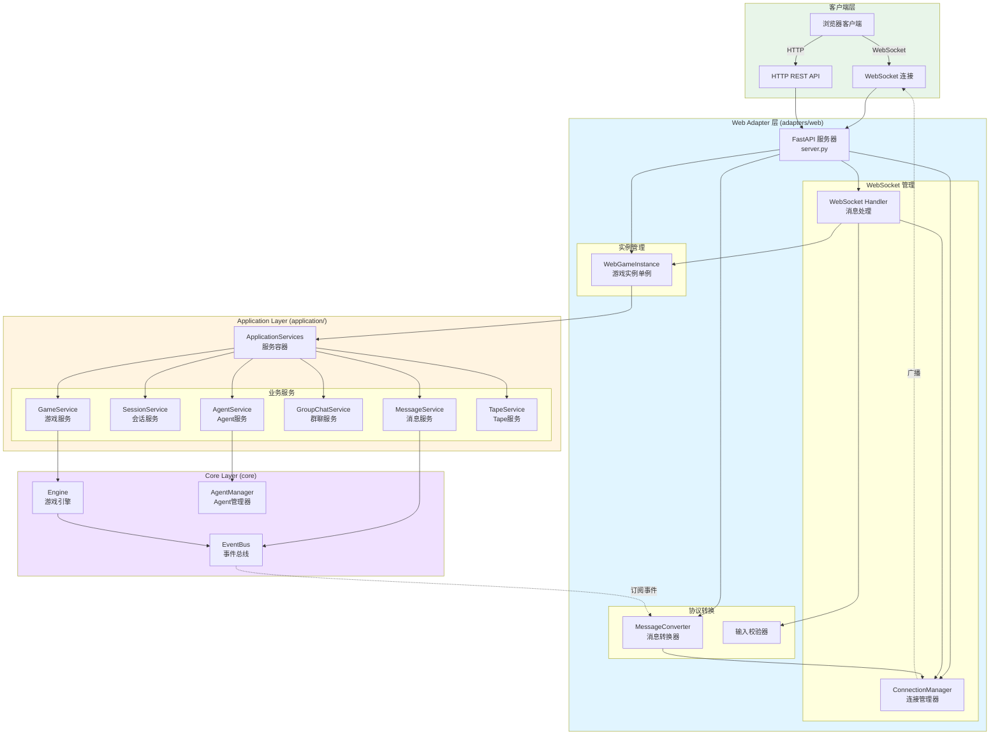
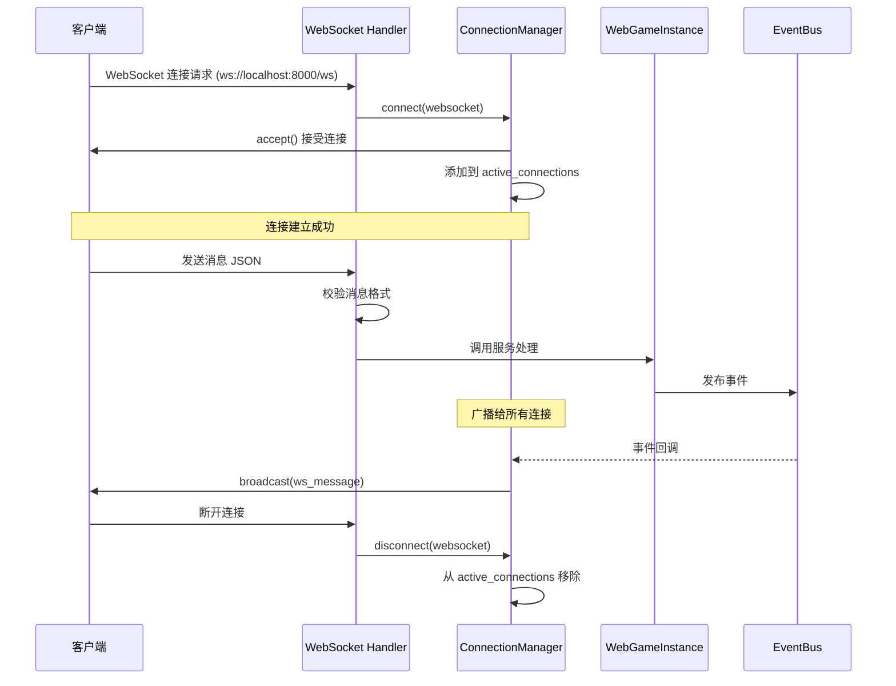
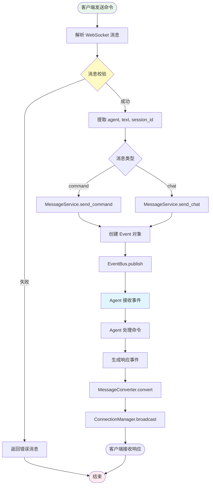
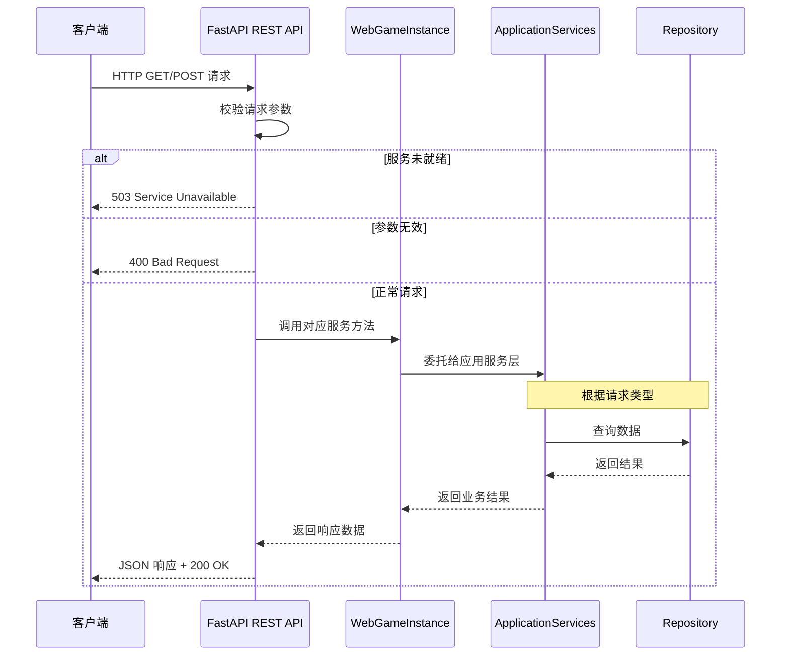
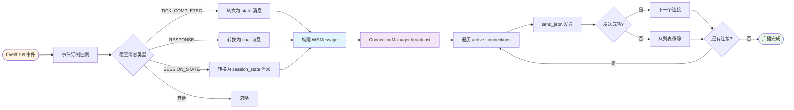
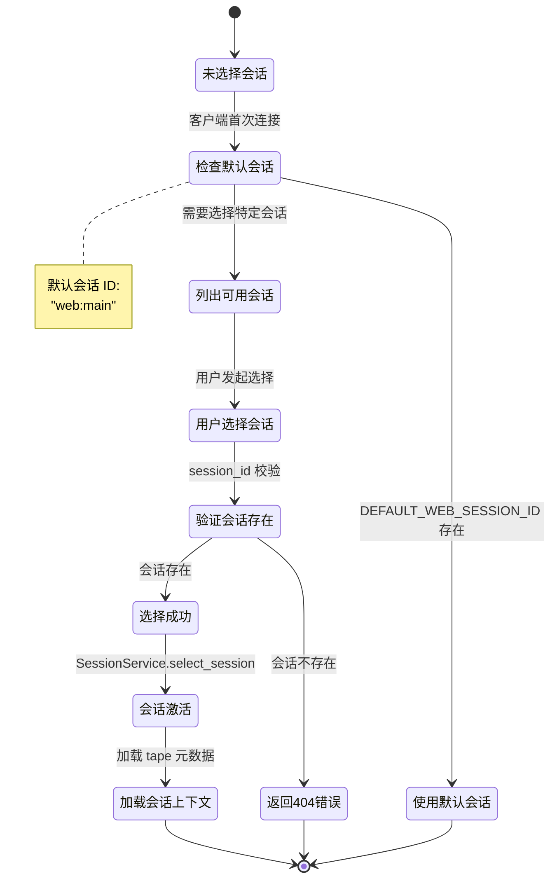
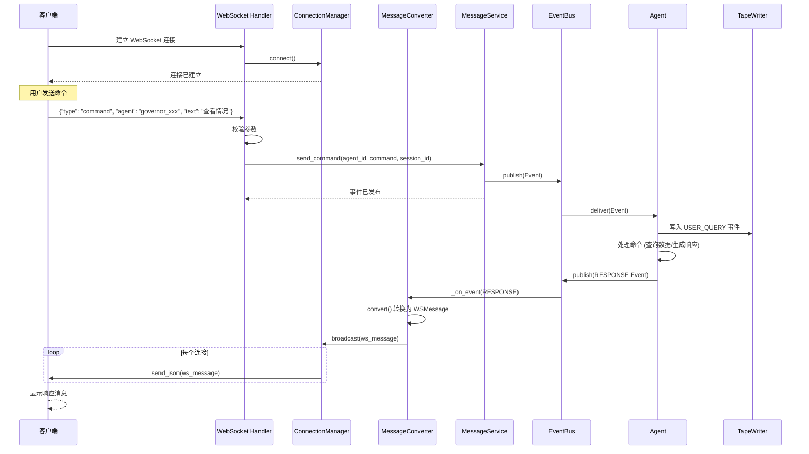

# Web Adapter 模块文档

## 模块概述

`src/simu_emperor/adapters/web` 模块是 Web 适配器层，基于 FastAPI 实现的实时通信服务器。

### 核心职责
- **协议转换**：HTTP/WebSocket 协议与内部 EventBus 事件之间的转换
- **实时通信**：WebSocket 连接管理和消息广播
- **REST API**：提供 HTTP 端点用于客户端交互

## 架构设计

### V4 重构要点
- 移除业务逻辑：所有业务逻辑委托给 ApplicationServices
- 单一职责：仅处理协议转换和消息路由
- 依赖注入：通过 WebGameInstance 管理服务依赖

### 模块结构
```
src/simu_emperor/adapters/web/
├── connection_manager.py  # WebSocket 连接管理
├── game_instance.py       # 游戏实例管理
├── message_converter.py   # 消息格式转换
└── server.py              # FastAPI 服务器实现
```

### 架构示意图



## API 端点说明

### WebSocket 端点
```
ws://localhost:8000/ws
```

### REST API 端点

#### 游戏状态 API
- `POST /api/command` - 发送命令到游戏
- `GET /api/state` - 查询当前游戏状态
- `GET /api/overview` - 查询帝国概况

#### 会话管理 API
- `GET /api/sessions` - 列出所有 session
- `POST /api/sessions` - 新建 session
- `POST /api/sessions/select` - 选择当前 session

#### Tape API
- `GET /api/tape/current` - 查询当前 session 的 tape 事件
- `GET /api/tape/subsessions` - 获取指定主会话的所有子 session

#### Agent API
- `GET /api/agents` - 列出所有活跃 agents
- `POST /api/agents/generate` - LLM 生成 agent 配置
- `POST /api/agents/add-generated` - 生成并启动 agent
- `GET /api/agents/jobs/{task_id}` - 查询 Agent 创建任务状态

#### Incident API
- `GET /api/incidents` - 列出所有活跃的 incidents

#### 群聊 API
- `GET /api/groups` - 列出所有群聊
- `POST /api/groups` - 创建群聊
- `POST /api/groups/message` - 向群聊发送消息
- `POST /api/groups/add-agent` - 添加 agent 到群聊
- `POST /api/groups/remove-agent` - 移除 agent

## 消息格式

### WebSocket 消息
**客户端 → 服务器**：
```json
{
    "type": "command" | "chat",
    "agent": "governor_zhili",
    "text": "查看直隶省情况",
    "session_id": "optional_session_id"
}
```

**服务器 → 客户端**：
```json
{
    "kind": "chat" | "state" | "event" | "error" | "session_state",
    "data": {...}
}
```

## 运行流程

### 1. WebSocket 连接流程



### 2. 命令发送流程



### 3. REST API 调用流程



### 4. 消息广播流程



### 5. 会话选择流程



### 6. 组件交互时序图（完整流程）



## 开发约束

### 架构约束
- Clean Architecture：Web 适配器不能直接依赖 Core 层
- 依赖注入：所有服务通过 ApplicationServices 获取

### 错误处理
- 验证失败：400 状态码
- 服务未就绪：503 状态码
- 资源不存在：404 状态码

### 性能考虑
- 并发发送：WebSocket 广播使用并发提高性能
- 连接清理：自动清理断开连接
