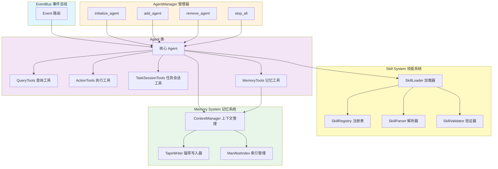
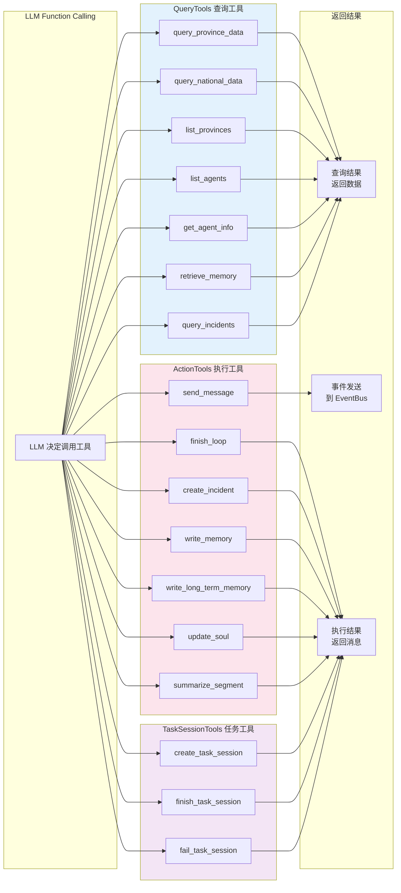
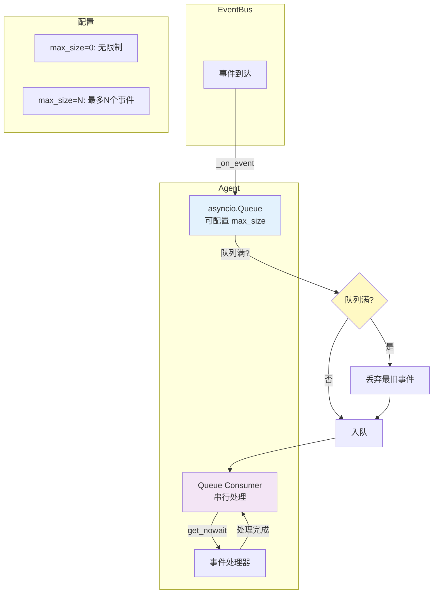
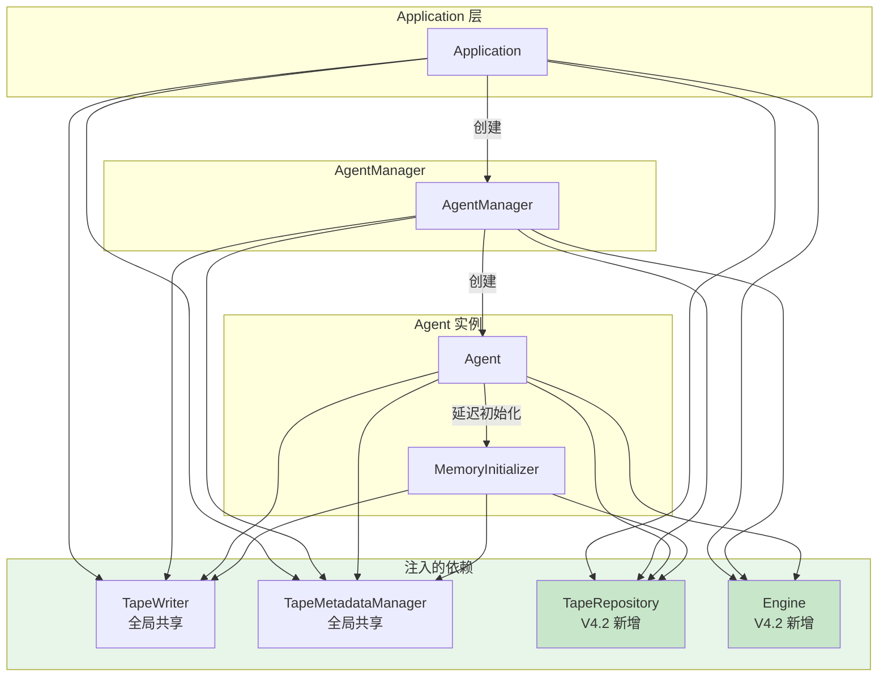
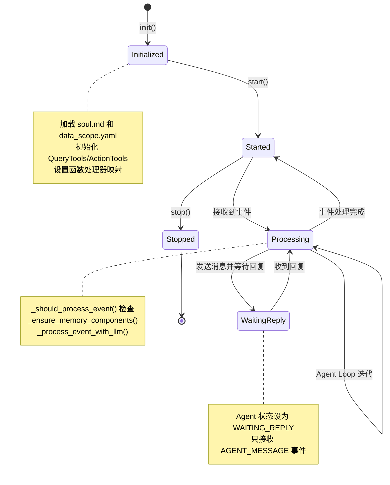
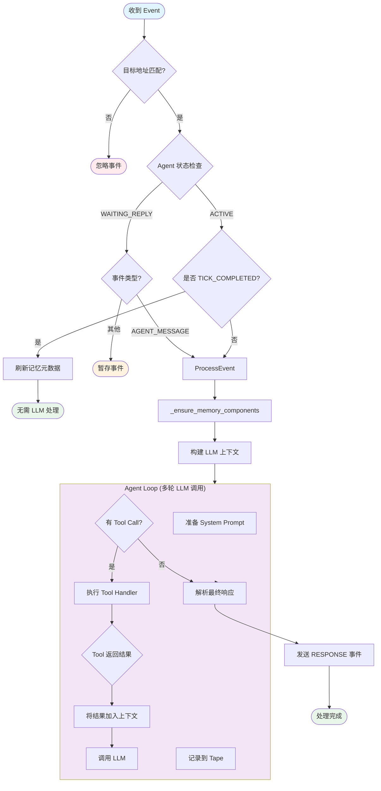
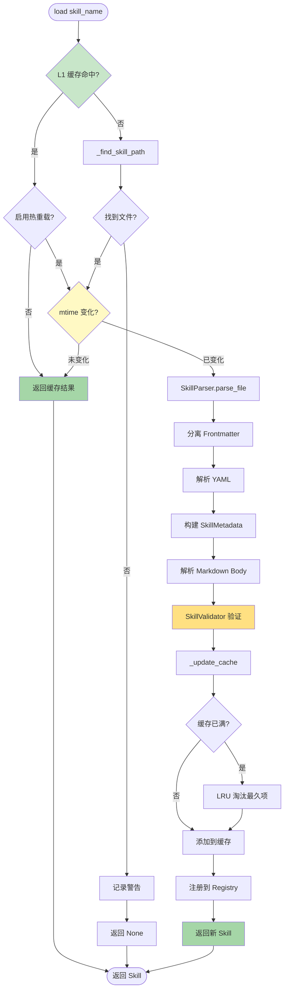
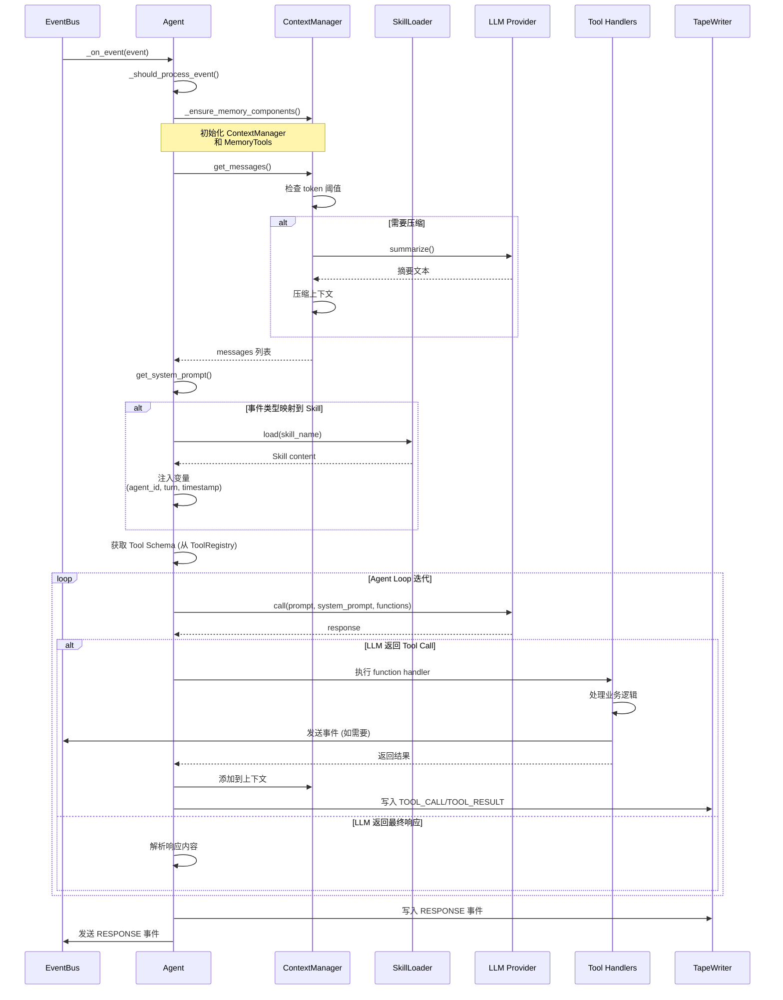
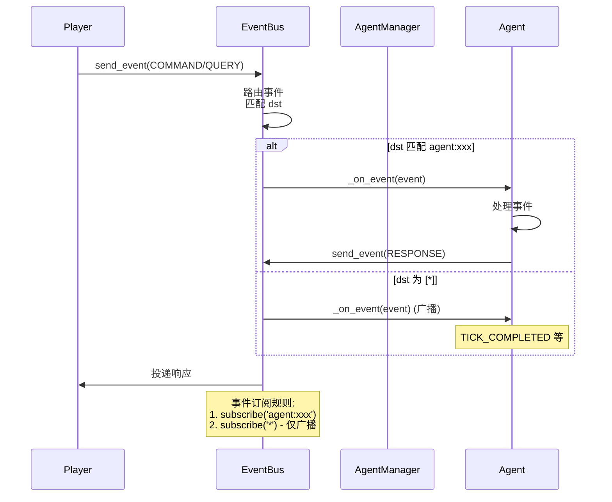

# Agents 模块文档

## 模块概述

Agents 模块是 Simu-Emperor 游戏的核心 AI 官员系统，实现了文件驱动的被动 Agent 架构。

### 核心特性
- **文件驱动**: Agent 的 personality 和权限由 Markdown/YAML 文件定义
- **被动响应**: 只响应事件，不主动发起行动
- **技能系统**: 基于 YAML Frontmatter + Markdown 的三级缓存技能加载
- **工具系统**: 分为 QueryTools（查询）和 ActionTools（执行）两大类

## 架构设计

### 1. 整体架构图



### 2. Skill System 三级缓存架构

```mermaid
graph TB
    subgraph L1["L1: 内存缓存 LRU"]
        direction TB
        L1Cache[OrderedDict<br/>max_size=50]
        L1Hit[缓存命中<br/>O(1)]
    end

    subgraph L2["L2: mtime 缓存"]
        direction TB
        MTimeCache[文件修改时间<br/>st_mtime]
        MTimeCheck{mtime 变化?}
    end

    subgraph L3["L3: 文件系统"]
        direction TB
        SkillFiles[data/skills/*.md]
        Parser[SkillParser<br/>YAML + Markdown]
        Validator[SkillValidator<br/>验证字段]
    end

    LoadRequest[load(skill_name)] --> L1Hit
    L1Hit -->|命中| L1Cache
    L1Hit -->|未命中| MTimeCheck

    MTimeCheck -->|未变化| L1Cache
    MTimeCheck -->|已变化| SkillFiles

    SkillFiles --> Parser
    Parser --> Validator
    Validator --> L1Cache

    L1Cache -.->|LRU 淘汰| Evict[移除最久未使用]

    style L1 fill:#c8e6c9
    style L2 fill:#fff9c4
    style L3 fill:#ffccbc
    style L1Hit fill:#a5d6a7
    style MTimeCheck fill:#ffe082
```

### 3. Tool 调用流程



### 4. V4.2 Event Queue 背压处理架构



**背压处理机制**：
- 使用 `asyncio.Queue` 实现事件队列
- 可配置 `max_size` 限制队列大小
- 队列满时丢弃最旧的事件（FIFO）
- 保证事件串行处理，避免并发问题

### 5. V4.2 ToolRegistry 架构

```mermaid
graph TB
    subgraph ToolRegistry["ToolRegistry 统一注册表"]
        TR[ToolRegistry]
        T1[Tool: query_province_data]
        T2[Tool: send_message]
        T3[Tool: create_task_session]
    end

    subgraph ToolDefinition["Tool 定义"]
        Name[name: str]
        Desc[description: str]
        Params[parameters: JSON Schema]
        Handler[handler: Callable]
        Category[category: query|action|memory|session]
    end

    subgraph Agent["Agent 使用"]
        Init[初始化时注册]
        Schema[导出 Function Schema]
        Call[LLM 调用 Handler]
    end

    TR --> T1 & T2 & T3
    T1 & T2 & T3 --> Name & Desc & Params & Handler & Category

    Init --> TR
    Schema --> TR.to_function_definitions
    Call --> TR.get

    style ToolRegistry fill:#e8f5e9
    style ToolDefinition fill:#fff9c4
```

**Tool 数据结构**：
```python
@dataclass
class Tool:
    name: str           # 工具名称（唯一标识符）
    description: str    # 工具描述（用于 LLM Function Calling）
    parameters: dict    # JSON Schema 参数定义
    handler: Callable   # 工具处理函数
    category: str       # 工具分类（query|action|memory|session）
```

### 6. V4.2 注入链路图



## 运行流程详解

### 1. Agent 生命周期流程



### 2. Agent 事件处理流程（Agent Loop）



### 3. Skill 加载流程



### 4. LLM 调用流程



### 5. Tool 调用流程

```mermaid
flowchart TD
    Start([LLM 返回 Tool Call]) --> ParseFunc[解析函数名和参数]
    ParseFunc --> Lookup{查找 Handler}

    Lookup -->|找到| Handler[_function_handlers[name]]
    Lookup -->|未找到| Error[返回错误]

    Handler --> TypeCheck{Tool 类型?}

    TypeCheck -->|QueryTools| QueryCall[调用 Query 方法]
    TypeCheck -->|ActionTools| ActionCall[调用 Action 方法]
    TypeCheck -->|TaskSessionTools| TaskCall[调用 Task 方法]
    TypeCheck -->|MemoryTools| MemoryCall[调用 Memory 方法]

    QueryCall --> QueryExec[查询 Repository 或文件]
    QueryExec --> QueryResult[格式化结果]
    QueryResult --> ReturnQuery

    ActionCall --> ActionExec[执行动作逻辑]
    ActionExec --> ActionSend{发送事件?}
    ActionSend -->|是| SendEvent[发送到 EventBus]
    ActionSend -->|否| FormatMsg[格式化消息]
    SendEvent --> ReturnAction
    FormatMsg --> ReturnAction
    ActionExec --> ReturnAction

    TaskCall --> TaskExec[创建/完成/失败任务]
    TaskExec --> TaskResult[返回 JSON 结果]
    TaskResult --> ReturnTask

    MemoryCall --> MemoryExec[检索记忆]
    MemoryExec --> MemoryResult[格式化结果]
    MemoryResult --> ReturnMemory

    ReturnQuery --> ReturnLLM
    ReturnAction --> ReturnLLM
    ReturnTask --> ReturnLLM
    ReturnMemory --> ReturnLLM

    ReturnLLM[返回给 LLM] --> LogTape[记录到 Tape]
    LogTape --> End([完成])

    Error --> End

    style Start fill:#e1f5fe
    style QueryCall fill:#e3f2fd
    style ActionCall fill:#fce4ec
    style TaskCall fill:#f3e5f5
    style MemoryCall fill:#e8f5e9
    style End fill:#c8e6c9
```

### 6. 与 EventBus 交互



## 组件详细说明

### 1. Agent 类

```python
class Agent:
    """AI 官员 Agent - 文件驱动的被动响应者"""

    # 初始化签名
    def __init__(
        self,
        agent_id: str,
        event_bus: EventBus,
        llm_provider: LLMProvider,
        data_dir: str | Path,
        repository=None,
        session_id: str | None = None,
        skill_loader=None,
        session_manager: SessionManager,
        # V4.1: 注入全局共享实例
        tape_writer: TapeWriter,
        tape_metadata_mgr: TapeMetadataManager,
        tape_repository: TapeRepository,  # V4.2: 新增
        engine: Engine,                   # V4.2: 新增
    )

    # 核心属性
    agent_id: str                    # 唯一标识符
    event_bus: EventBus              # 事件总线
    llm_provider: LLMProvider        # LLM 提供商
    data_dir: Path                   # 数据目录
    repository: Any                  # GameRepository
    session_manager: SessionManager  # 会话管理器

    # 工具实例
    _query_tools: QueryTools         # 查询工具
    _action_tools: ActionTools       # 执行工具
    _task_session_tools: TaskSessionTools  # 任务会话工具
    _memory_tools: MemoryTools       # 记忆工具（延迟初始化）

    # 记忆系统
    _context_manager: ContextManager # 上下文管理器（延迟初始化）
    _tape_writer: TapeWriter         # 磁带写入器
    _tape_metadata_mgr: TapeMetadataManager  # 元数据管理器
    _tape_repository: TapeRepository # V4.2: Tape 仓库（持久化）
    _engine: Engine                  # V4.2: 引擎实例（用于 incident 查询）

    # V4.2: 事件队列（背压处理）
    _event_queue: asyncio.Queue      # 事件队列（可配置 max_size）

    # Skill 系统
    _skill_loader: SkillLoader       # 技能加载器

    # 生命周期方法
    start()                          # 启动 Agent，订阅事件
    stop()                           # 停止 Agent，取消订阅
    _on_event(event)                 # 统一事件处理入口
    _should_process_event(event)     # 检查是否应该处理事件

    # 核心处理流程
    _process_event_with_llm(event)   # LLM 处理事件（Agent Loop）
    _ensure_memory_components(session_id)  # 确保记忆组件已初始化
    start_event_queue_consumer()     # V4.2: 启动事件队列消费者
    _enqueue_event(event)            # V4.2: 事件入队（带背压）
```

### 2. AgentManager 生命周期管理

```python
class AgentManager:
    """Agent 管理器"""

    # 初始化签名
    def __init__(
        self,
        event_bus: EventBus,
        llm_provider: LLMProvider,
        template_dir: Path | str = Path("data/default_agents"),
        agent_dir: Path | str = Path("data/agent"),
        repository=None,
        session_id: str | None = None,
        session_manager=None,
        tape_writer: TapeWriter,
        tape_metadata_mgr: TapeMetadataManager,
        tape_repository: TapeRepository,  # V4.2: 新增
        engine: Engine,                   # V4.2: 新增
    )

    # 核心功能
    initialize_agent(agent_id)       # 从模板初始化 Agent
    add_agent(agent_id)              # 添加并启动 Agent
    remove_agent(agent_id)           # 移除并停止 Agent
    stop_all()                       # 停止所有 Agent

    # 查询功能
    get_all_agents()                 # 获取所有可用 Agent
    get_active_agents()              # 获取活跃 Agent
    get_agent(agent_id)              # 获取 Agent 实例

    # 属性
    template_dir: Path               # Agent 模板目录
    agent_dir: Path                  # Agent 工作目录
    tape_repository: TapeRepository  # V4.2: Tape 仓库
    engine: Engine                   # V4.2: 引擎实例
    _active_agents: dict             # 活跃 Agent 字典
```

### 3. Skill 系统

#### SkillLoader - 三级缓存加载器

```python
class SkillLoader:
    """Skill 加载器 - 三级缓存"""

    # 缓存层级
    _memory_cache: OrderedDict       # L1: 内存缓存（LRU, max_size=50）
    _mtime_cache: dict               # L2: 文件修改时间缓存

    # 组件
    _parser: SkillParser             # L3: 文件解析器
    registry: SkillRegistry          # Skill 注册表

    # 核心方法
    load(skill_name: str) -> Skill   # 加载 Skill（三级缓存）
    _find_skill_path(skill_name)     # 查找 Skill 文件路径
    _update_cache(name, skill, mtime) # 更新缓存（LRU 淘汰）
    clear_cache()                    # 清空所有缓存
```

#### Skill 数据模型

```python
@dataclass(frozen=True)
class SkillMetadata:
    """Skill 元数据（YAML Frontmatter）"""
    name: str                        # Skill 名称
    description: str                 # 描述
    version: str = "1.0"             # 版本号
    tags: tuple[str, ...]            # 标签
    priority: int = 10               # 优先级
    required_tools: tuple[str, ...]  # 需要的工具

@dataclass(frozen=True)
class Skill:
    """Skill 对象"""
    metadata: SkillMetadata          # 元数据
    content: str                     # Markdown 内容
    file_path: Path                  # 文件路径
    mtime: float                     # 修改时间
```

#### 事件到 Skill 映射

```python
DEFAULT_EVENT_SKILL_MAP = {
    EventType.CHAT: "chat",
    EventType.AGENT_MESSAGE: "receive_message",
    EventType.TICK_COMPLETED: "on_tick_completed",
}
```

### 4. Tool 系统

#### QueryTools - 查询工具

```python
class QueryTools:
    """查询工具处理器 - 返回数据给 LLM"""

    async def query_province_data(args, event) -> str
    async def query_national_data(args, event) -> str
    async def list_provinces(args, event) -> str
    async def list_agents(args, event) -> str
    async def get_agent_info(args, event) -> str
    async def query_incidents(args, event) -> str   # V4.2: 查询活跃事件
    # retrieve_memory 由 MemoryTools 提供
```

#### ActionTools - 执行工具

```python
class ActionTools:
    """执行工具处理器 - 执行副作用"""

    # V4.2: 统一的消息发送（替代 send_message_to_agent + respond_to_player）
    async def send_message(args, event) -> str | tuple
        """统一消息发送 - 支持 player 和其他 agent"""

    async def finish_loop(args, event) -> str
    async def create_incident(args, event) -> str
    async def write_memory(args, event) -> None
    async def write_long_term_memory(args, event) -> str  # V4.2: 写入长期记忆
    async def update_soul(args, event) -> str             # V4.2: 更新性格记录
    async def summarize_segment(args, event) -> str       # V4.2: 段落摘要
```

#### TaskSessionTools - 任务会话工具

```python
class TaskSessionTools:
    """任务会话工具处理器"""

    async def create_task_session(...) -> dict
    async def finish_task_session(...) -> dict
    async def fail_task_session(...) -> dict
```

### 5. 函数处理器映射

```python
# Agent 初始化时构建的函数映射
_function_handlers: dict[str, callable] = {
    # Query 类
    "query_province_data": _query_tools.query_province_data,
    "query_national_data": _query_tools.query_national_data,
    "list_provinces": _query_tools.list_provinces,
    "list_agents": _query_tools.list_agents,
    "get_agent_info": _query_tools.get_agent_info,
    "query_incidents": _query_tools.query_incidents,  # V4.2: 新增

    # Memory 类
    "retrieve_memory": _retrieve_memory_wrapper,

    # Action 类（V4.2: 统一 send_message）
    "send_message": _create_action_wrapper(...),
    "finish_loop": _create_action_wrapper(...),
    "create_incident": _create_action_wrapper(...),
    "write_memory": _create_action_wrapper(...),
    "write_long_term_memory": _create_action_wrapper(...),  # V4.2: 新增
    "update_soul": _create_action_wrapper(...),             # V4.2: 新增
    "summarize_segment": _create_action_wrapper(...),       # V4.2: 新增

    # Task Session 类
    "create_task_session": _wrap_create_task_session,
    "finish_task_session": _wrap_finish_task_session,
    "fail_task_session": _wrap_fail_task_session,
}
```

### 6. Memory 系统集成

```python
class MemoryInitializer:
    """记忆系统初始化器 - 延迟初始化 ContextManager 和 MemoryTools"""

    # 初始化签名（V4.2）
    def __init__(
        self,
        agent_id: str,
        memory_dir: Path,
        llm_provider: LLMProvider,
        tape_writer: TapeWriter,
        tape_metadata_mgr: TapeMetadataManager | None = None,
        tape_repository: TapeRepository | None = None,  # V4.2: 新增
    )

    async def initialize(session_id: str) -> tuple[ContextManager, MemoryTools]
```

```python
class ContextManager:
    """上下文管理器 - 滑动窗口 + 自动压缩"""

    async def get_messages() -> list[dict]  # 获取消息（LLM 格式）
    async def add_message(role, content)    # 添加消息
    async def compact()                     # 压缩上下文（触发 summarization）
```

```python
class MemoryTools:
    """记忆工具处理器"""

    async def retrieve_memory(args, event) -> str  # 自然语言查询
```

## 文件驱动设计

### soul.md 格式

```markdown
# [官职] - [姓名]

## 身份
你是[朝代][官职]，负责[职责范围]

## 性格
- 性格特点1
- 性格特点2

## 行为倾向
- 行为模式1
- 行为模式2

## 说话风格
语言特色和表达习惯
```

### data_scope.yaml 格式

```yaml
skills:
  query_data:
    provinces: [zhili, jiangnan]
    fields:
      - population.*
      - agriculture.*

  execute_command:
    provinces: [zhili]
    fields:
      - agriculture.irrigation_level
    inherits: query_data
```

## Skill 文件格式

### YAML Frontmatter

```yaml
---
name: skill_name
description: 技能描述
version: "2.0"
tags: [query, data_access]
priority: 10
required_tools:
  - query_national_data
  - query_province_data
---
```

## 开发约束

### 1. Skill 开发规范
- 文件名必须与 `name` 字段一致
- 扩展名使用 `.md`
- 严格遵循 `data_scope.yaml` 定义

### 2. 错误处理原则
- 提供具体的错误原因
- 记录详细日志
