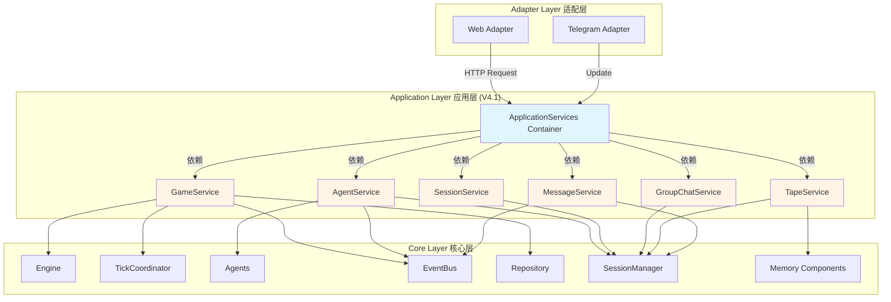
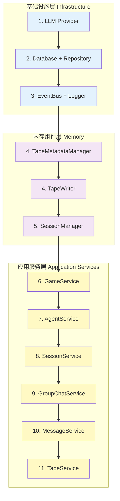
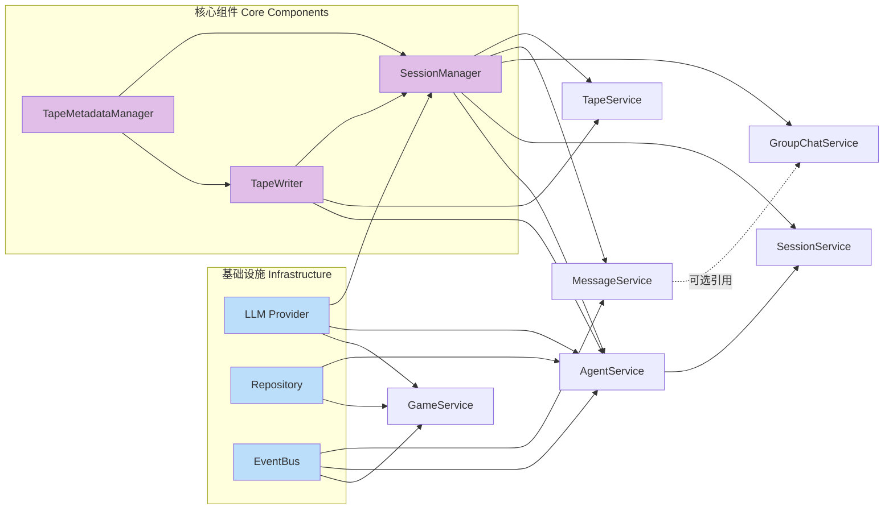
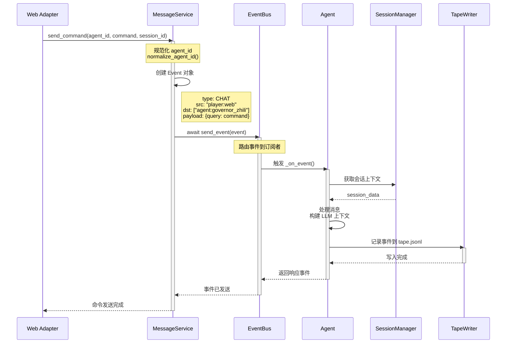
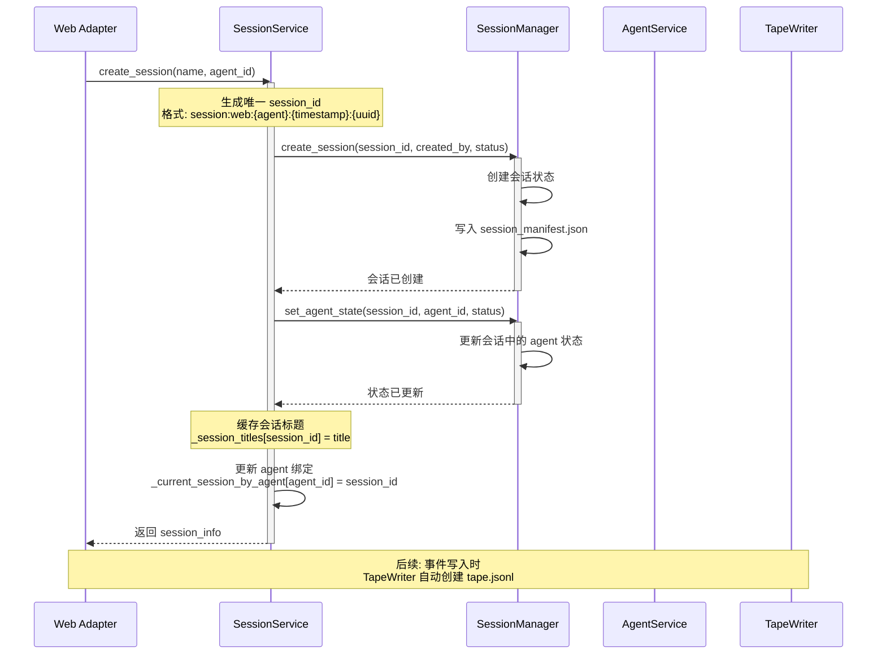

# Application Layer 模块文档

## 模块概述

`application` 模块是 V4.1 架构中的 **应用层（Application Layer）**，实现了 Clean Architecture 中的业务逻辑层。

### 核心定位
- **业务逻辑层**：封装所有业务规则和用例逻辑
- **服务容器**：通过 `ApplicationServices` 统一管理所有服务实例
- **依赖注入**：实现松耦合的组件设计和生命周期管理

## 架构设计

### Clean Architecture 分层



### 服务初始化顺序



### 服务依赖关系图



## 运行流程详解

### 服务初始化流程

```mermaid
sequenceDiagram
    participant Client as 客户端
    participant AS as ApplicationServices
    participant Infra as 基础设施
    participant Memory as 内存组件
    participant Services as 应用服务

    Client->>AS: ApplicationServices.create(settings)
    activate AS

    Note over AS,Infra: 1. 初始化基础设施
    AS->>Infra: 创建 LLM Provider
    AS->>Infra: 创建 Database + Repository
    AS->>Infra: 创建 EventBus + Logger

    Note over AS,Memory: 2. 初始化内存组件
    AS->>Memory: 创建 TapeMetadataManager
    AS->>Memory: 创建 TapeWriter
    AS->>Memory: 创建 SessionManager
    AS->>Memory: 创建主会话 session:web:main

    Note over AS,Services: 3. 创建应用服务（按依赖顺序）
    AS->>Services: 创建 GameService
    AS->>Services: 创建 AgentService
    AS->>Services: 创建 SessionService
    AS->>Services: 创建 GroupChatService
    AS->>Services: 创建 MessageService
    AS->>Services: 创建 TapeService

    AS-->>Client: 返回 ApplicationServices 实例
    deactivate AS

    Note over Client,Services: 4. 启动服务
    Client->>AS: await services.start()
    AS->>Services: GameService.initialize()
    AS->>Services: AgentService.initialize_agents()
    deactivate AS
```

### 命令发送流程



### 会话创建流程



### 消息路由流程

```mermaid
flowchart TD
    Start([接收消息]) --> Parse{消息类型判断}

    Parse -->|/command| Command[命令消息]
    Parse -->|普通文本| Chat[聊天消息]
    Parse -->|/group| GroupMsg[群聊消息]

    Command --> Normalize[规范化 agent_id<br/>strip_agent_prefix]
    Chat --> Normalize
    GroupMsg --> Normalize

    Normalize --> CreateEvent[创建 Event 对象]
    CreateEvent --> SetPayload{设置 payload}

    SetPayload -->|命令| CmdPayload[payload: {query: command}]
    SetPayload -->|聊天| ChatPayload[payload: {message: text}]
    SetPayload -->|群聊| GroupPayload[payload: {message: text}]

    CmdPayload --> Emit
    ChatPayload --> Emit
    GroupPayload --> Emit

    Emit[EventBus.emit] --> Route{路由类型}

    Route -->|单 agent| Single[dst: [agent:xxx]]
    Route -->|多 agent| Multi[dst: [agent:a, agent:b]]
    Route -->|广播| Broadcast[dst: [*]]

    Single --> AgentTrigger[触发 Agent._on_event]
    Multi --> AgentTrigger
    Broadcast --> AllAgents[触发所有订阅者]

    AgentTrigger --> Process[Agent 处理流程]
    Process --> GetSession[获取会话上下文]
    GetSession --> BuildContext[构建 LLM 上下文]
    BuildContext --> CallLLM[调用 LLM]
    CallLLM --> WriteTape[写入 tape.jsonl]
    WriteTape --> Response[发送响应事件]

    AllAgents --> Response
    Response --> End([完成])

    style Start fill:#c8e6c9
    style End fill:#c8e6c9
    style Command fill:#fff9c4
    style Chat fill:#fff9c4
    style GroupMsg fill:#fff9c4
    style AgentTrigger fill:#e1bee7
    style Response fill:#b2dfdb
```

## 服务类详解

### GameService
- 游戏实例的生命周期管理
- 游戏状态的初始化和加载
- Engine 和 TickCoordinator 的协调

### SessionService
- 会话的创建、选择和管理
- 代理与会话的绑定
- 会话上下文管理

### AgentService
- 代理的生命周期管理
- 代理可用性检查
- 动态代理生成

### GroupChatService
- 群聊的创建和管理
- 代理的添加和移除
- 群聊消息处理

### MessageService
- 消息解析（command/chat）
- 事件创建和路由
- 消息投递到代理

### TapeService
- 磁带事件查询
- 子会话管理
- 从磁带文件检索事件

## 开发约束

### 依赖注入原则
- 构造函数注入
- 接口分离
- 依赖倒置

### 生命周期管理
- 严格按照依赖关系初始化
- 反向顺序关闭
- 单例模式用于全局共享组件

### 错误处理
- 显式错误：不使用静默失败或硬编码回退
- 错误传播：异常向上传播
- 日志记录：使用结构化日志
