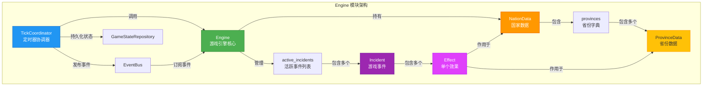
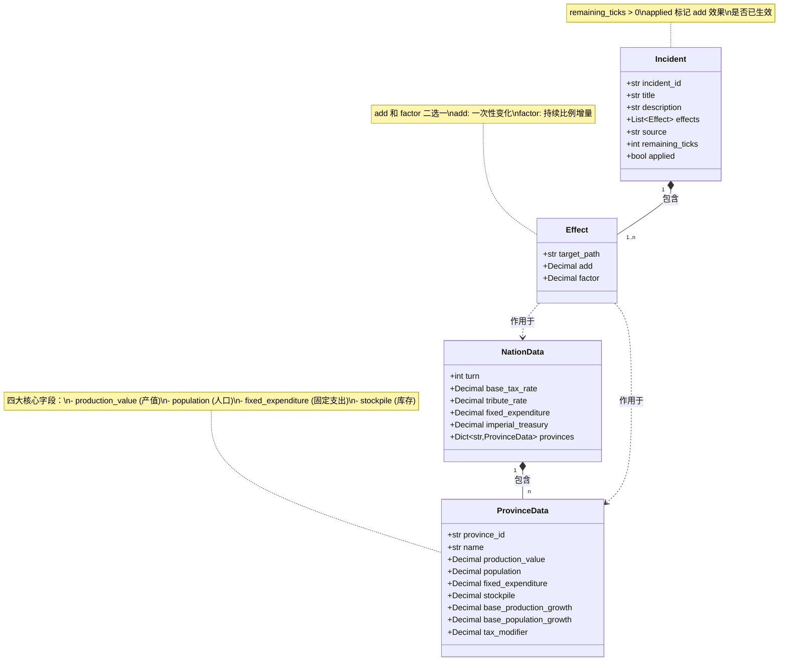
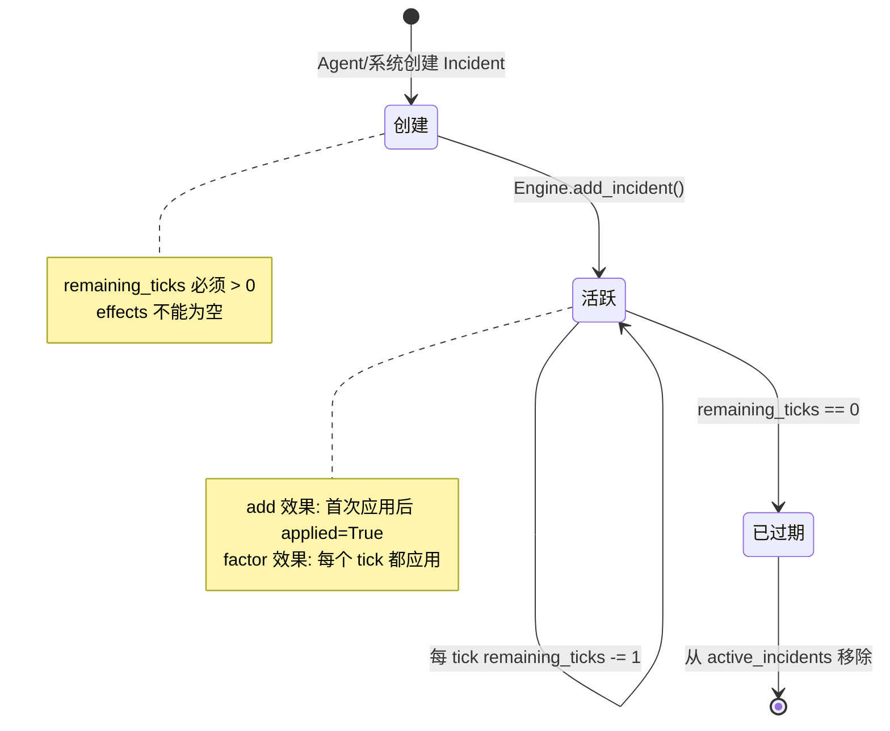
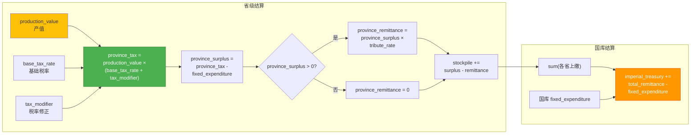

# Engine 模块文档

## 模块概述

`simu_emperor/engine` 是 V4 版本的核心游戏引擎模块，采用基于 tick 的时间推进机制。

### 核心职责
- 游戏状态管理（NationData 及其 ProvinceData）
- Tick 自动计算逻辑（1 tick = 1 周）
- 事件系统（Incident/Effect）的创建和管理
- 经济系统计算（税收、国库、财政分配）

## 架构设计

### 整体架构图



### 数据模型关系图



### 核心组件

1. **Engine** - 游戏引擎核心
   - 拥有并独占修改 NationData
   - 应用基础增长率、活跃 Effects
   - 计算税收和国库更新
   - 管理 Incident 生命周期

2. **TickCoordinator** - Tick 计时器协调器
   - 定时触发 tick（默认 5 秒间隔）
   - 发布 tick_completed 事件
   - 持久化游戏状态

3. **数据模型** - 简化的 4 字段架构
   - ProvinceData：省级核心数据
   - NationData：国家全局数据
   - Incident：时间限制的游戏事件
   - Effect：单个数据修改效果

## 数据模型

### ProvinceData - 省份数据

```python
@dataclass
class ProvinceData:
    province_id: str
    name: str

    # 四大核心字段
    production_value: Decimal  # 产值
    population: Decimal       # 人口
    fixed_expenditure: Decimal  # 固定支出
    stockpile: Decimal        # 库存

    # 增长率（固定）
    base_production_growth: Decimal = Decimal("0.01")   # 1%/tick
    base_population_growth: Decimal = Decimal("0.005")  # 0.5%/tick

    # 税率修正
    tax_modifier: Decimal = Decimal("0.0")
```

### NationData - 国家数据

```python
@dataclass
class NationData:
    turn: int                           # 当前 tick 数
    base_tax_rate: Decimal = Decimal("0.10")  # 基础税率 10%
    tribute_rate: Decimal = Decimal("0.8")    # 上缴比例 80%
    fixed_expenditure: Decimal = Decimal("0")  # 国库固定支出
    imperial_treasury: Decimal = Decimal("0")  # 国库
    provinces: Dict[str, ProvinceData]
```

### Incident/Effect - 游戏事件

```python
@dataclass
class Effect:
    target_path: str        # "provinces.zhili.production_value"
    add: Optional[Decimal]  # 一次性变化
    factor: Optional[Decimal]  # 持续比例增量

@dataclass
class Incident:
    incident_id: str
    title: str
    description: str
    effects: List[Effect]
    source: str
    remaining_ticks: int  # 持续 tick 数（必须 > 0）
    applied: bool = False
```

## Tick 计算流程

### Tick 协调器时序图

```mermaid
sequenceDiagram
    participant Loop as 定时循环
    participant TC as TickCoordinator
    participant ENG as Engine
    participant REPO as GameStateRepository
    participant EB as EventBus
    participant AGENTS as 各个 Agent

    Loop->>TC: 触发 tick (每5秒)
    TC->>ENG: apply_tick()

    Note over ENG: 保存当前状态(_save_previous_values)

    ENG->>ENG: 应用基础增长率<br/>(_apply_base_growth)
    Note right of ENG: production_value *= 1.01<br/>population *= 1.005

    ENG->>ENG: 应用所有活跃 Effects<br/>(_apply_effects)
    Note right of ENG: 按 target_path 分组<br/>累加 add 和 factor<br/>应用公式: (target+sum_add)*(1+sum_factor)

    ENG->>ENG: 计算税收和国库<br/>(_calculate_tax_and_treasury)
    Note right of ENG: 计算各省税收<br/>计算上缴和库存<br/>更新国库

    ENG->>ENG: 刷新 Incident 状态<br/>(_refresh_incidents)
    Note right of ENG: remaining_ticks -= 1<br/>移除已到期事件

    ENG->>ENG: state.turn += 1

    ENG-->>TC: 返回新状态

    TC->>REPO: save_nation_data(state)

    TC->>EB: send_event(tick_completed)
    EB->>AGENTS: 广播事件

    Note over AGENTS: Agent 收到 tick_completed<br/>决定是否响应
```

### Tick 计算详细流程图

```mermaid
flowchart TD
    Start([开始 Tick]) --> Save[保存当前状态<br/>_save_previous_values]
    Save --> BaseGrowth[应用基础增长率<br/>_apply_base_growth]

    BaseGrowth --> GrowthLoop{遍历所有省份}
    GrowthLoop -->|每个省份| ApplyGrowth[production_value *= 1.01<br/>population *= 1.005]
    ApplyGrowth --> GrowthLoop

    GrowthLoop -->|完成| ApplyEffects[应用所有活跃 Effects<br/>_apply_effects]

    ApplyEffects --> GroupEffects[按 target_path 分组 Effects]
    GroupEffects --> ProcessPath{处理每个 target_path}

    ProcessPath --> ResolvePath[解析路径获取目标值]
    ResolvePath --> SumEffects[累加 add 和 factor]
    SumEffects --> CalcNew[计算新值<br/>max(0, (target+sum_add) * (1+sum_factor))]
    CalcNew --> SetValue[写回新值]
    SetValue --> ProcessPath

    ProcessPath -->|所有路径处理完成| MarkApplied[标记 Incident.applied = True]

    MarkApplied --> TaxCalc[计算税收和国库<br/>_calculate_tax_and_treasury]

    TaxCalc --> TaxLoop{遍历所有省份}
    TaxLoop -->|每个省份| CalcProvince[计算省级税收、结余、上缴]
    CalcProvince --> UpdateStock[更新省级库存<br/>stockpile += surplus - remittance]
    UpdateStock --> TaxLoop

    TaxLoop -->|完成| CalcTreasury[更新国库<br/>treasury += total_remittance - fixed_exp]

    CalcTreasury --> RefreshInc[刷新 Incident 状态<br/>_refresh_incidents]

    RefreshInc --> DecTicks[所有 Incident.remaining_ticks -= 1]
    DecTicks --> RemoveExpired[移除 remaining_ticks == 0 的事件]

    RemoveExpired --> IncTurn[state.turn += 1]
    IncTurn --> Return([返回新状态])

    style Start fill:#4CAF50,stroke:#2E7D32,color:#fff
    style Return fill:#4CAF50,stroke:#2E7D32,color:#fff
    style ApplyEffects fill:#2196F3,stroke:#1565C0,color:#fff
    style TaxCalc fill:#FF9800,stroke:#E65100,color:#fff
    style RefreshInc fill:#9C27B0,stroke:#6A1B9A,color:#fff
```

### Effect 应用流程详解

```mermaid
flowchart TD
    subgraph "Effect 应用机制"
        Start([Incident 包含 Effect]) --> CheckType{检查 Effect 类型}

        CheckType -->|add 效果| AddCheck{检查<br/>Incident.applied}
        CheckType -->|factor 效果| FactorApply[每个 tick 都应用]

        AddCheck -->|未应用| ApplyAdd[累加到 sum_add<br/>标记 incident_id]
        AddCheck -->|已应用| SkipAdd[跳过此 add]

        ApplyAdd --> Collect
        FactorApply --> Collect[收集该 target_path<br/>的所有 Effect]
        SkipAdd --> Collect

        Collect --> ApplyFormula[应用公式<br/>new_value = max(0,<br/>(target + sum_add) * (1 + sum_factor))]
        ApplyFormula --> WriteBack[写回目标路径]
        WriteBack --> End([Effect 应用完成])

        Note1[注意: add 效果只生效一次<br/>factor 效果每个 tick 都生效]
        Note1 -.-> CheckType
    end

    style Start fill:#E040FB,stroke:#AA00FF,color:#fff
    style End fill:#4CAF50,stroke:#2E7D32,color:#fff
    style ApplyFormula fill:#FF9800,stroke:#E65100,color:#fff
    style Note1 fill:#fff3cd,stroke:#ffb300
```

### Incident 生命周期



## 经济公式

### 税收和国库计算流程图



### 公式说明

**省级税收**：`province_tax = production_value × (base_tax_rate + tax_modifier)`

**省级结余**：`province_surplus = province_tax - fixed_expenditure`

**省级上缴**：`province_remittance = max(0, province_surplus × tribute_rate)`

**省级库存**：`stockpile = max(0, province_surplus - province_remittance)`

**国库更新**：`imperial_treasury = max(0, imperial_treasury + sum(上缴) - fixed_expenditure)`

## 开发约束

### 状态管理
- Engine 拥有并独占修改 NationData
- 调用方不应持有 state 引用并在外部修改

### 事件系统
- add 和 factor 必须二选一
- remaining_ticks 必须 > 0
- factor 必须 > -1.0
