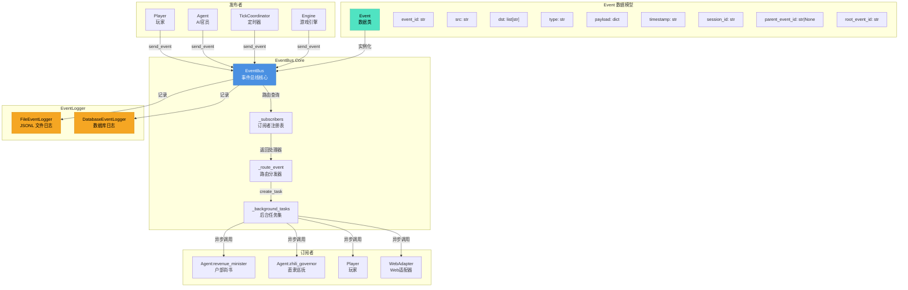
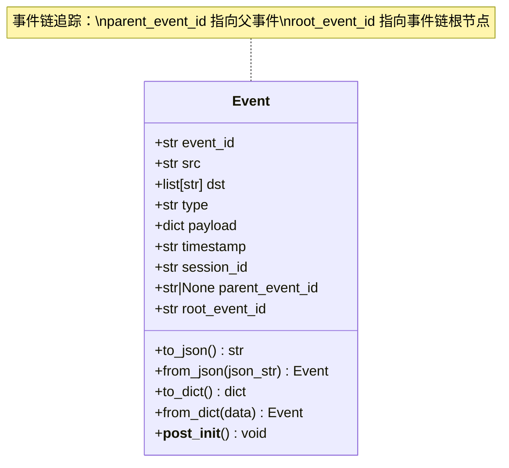
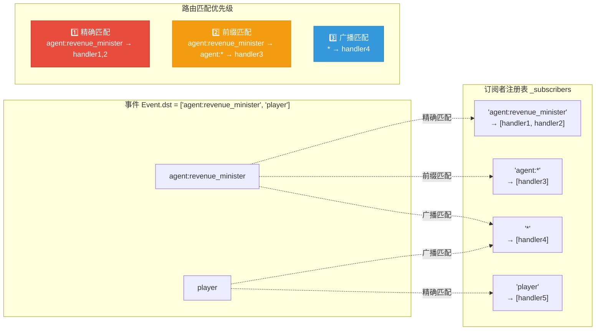
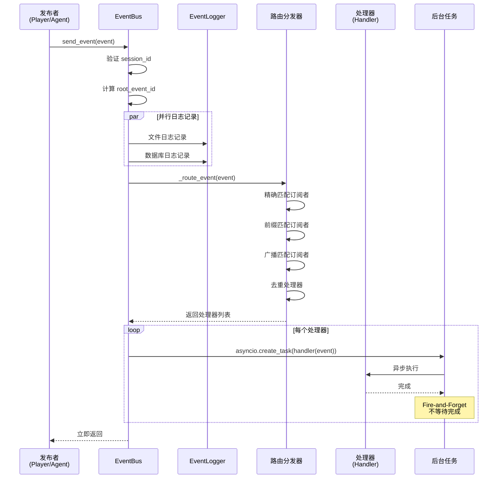
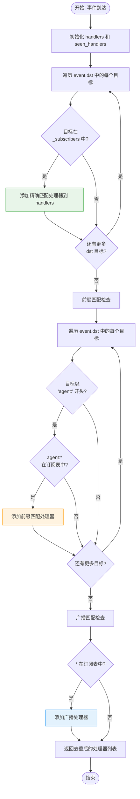
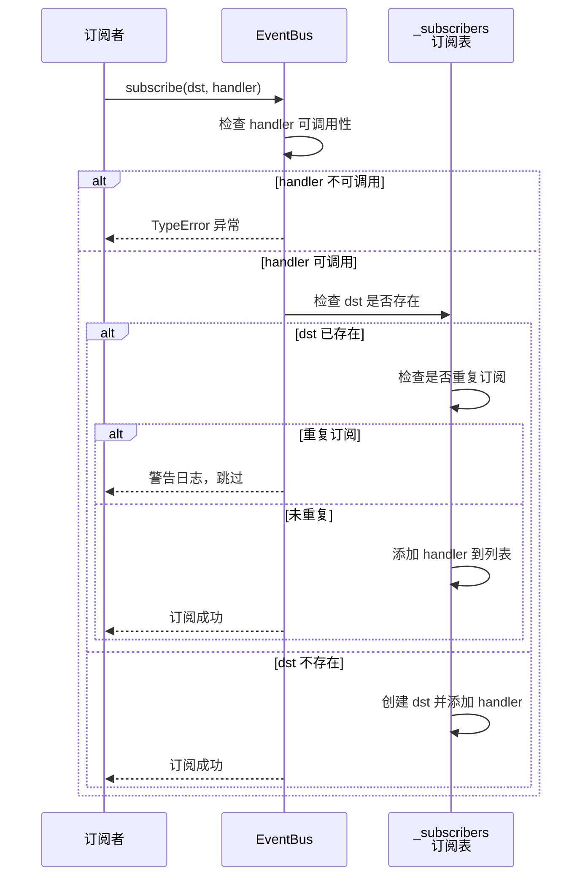
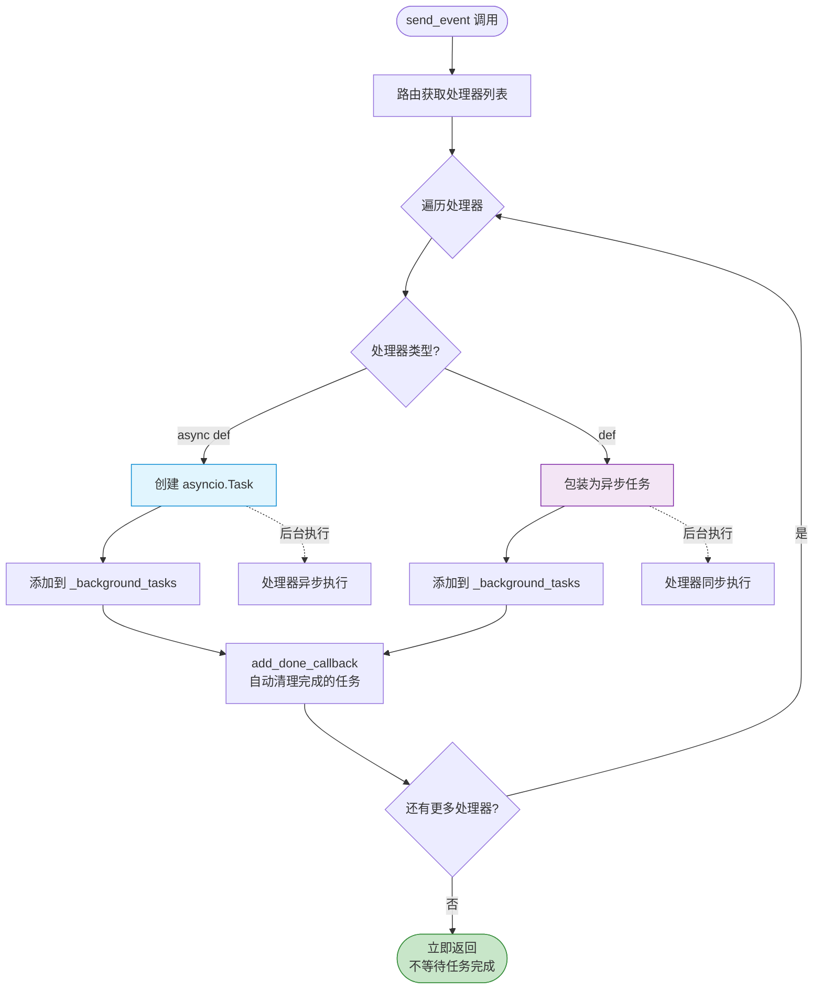
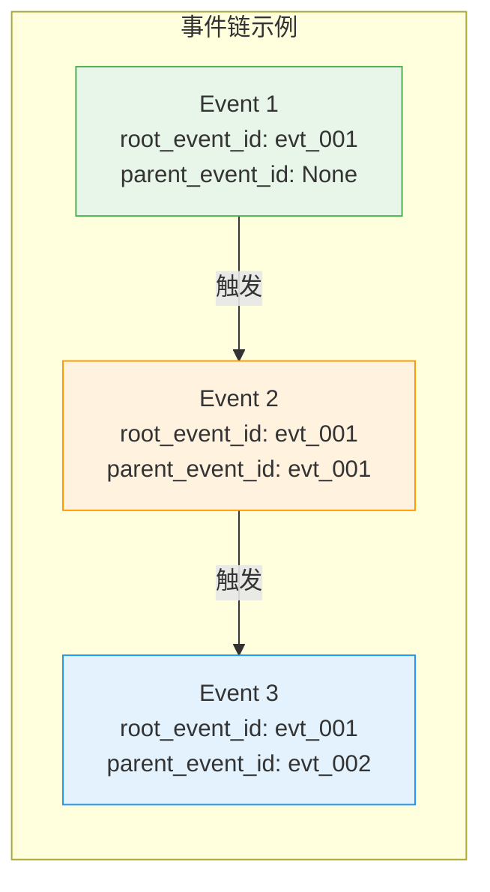

# EventBus 模块文档

## 模块概述

EventBus 是事件驱动架构的核心基础设施，提供了事件的订阅、发布、路由分发和日志记录功能。该模块实现了完全异步的事件处理机制，支持单播、组播和广播模式。

## 架构设计

### 系统架构示意图



### Event 数据类结构



### 路由规则示意图



### 核心组件

#### 1. EventBus 类 (`core.py`)

事件总线的主要实现，负责：
- **事件订阅管理**：维护目标标识符与处理器映射关系
- **事件路由分发**：根据目标标识符将事件路由到匹配的处理器
- **异步任务调度**：使用 fire-and-forget 模式异步执行处理器
- **日志记录集成**：支持文件和数据库双重日志记录

**路由规则优先级**（从高到低）：
1. **精确匹配**：`dst` 精确匹配订阅者
2. **前缀匹配**：`dst` 以 "agent:" 开头时匹配 "agent:*"
3. **广播匹配**：匹配 `*` 通配符

#### 2. Event 数据模型 (`event.py`)

事件的数据结构实现，包含：
- **事件标识**：`event_id`（自动生成UUID）
- **源目标**：`src`（事件发起方）、`dst`（接收方列表）
- **事件类型**：`type`（定义事件分类）
- **负载数据**：`payload`（任意JSON序列化数据）
- **会话标识**：`session_id`（多用户隔离）
- **事件链追踪**：`parent_event_id`、`root_event_id`

#### 3. EventType 枚举 (`event_types.py`)

预定义的事件类型常量，分类包括：

**玩家交互事件**：`CHAT`

**Agent响应事件**：`RESPONSE`, `AGENT_MESSAGE`

**记忆系统事件**（V3 Memory）：`USER_QUERY`, `ASSISTANT_RESPONSE`, `TOOL_CALL`, `TOOL_RESULT`

**系统事件**：`SESSION_STATE`, `TICK_COMPLETED`, `INCIDENT_CREATED`

**Task生命周期事件**：`TASK_CREATED`, `TASK_FINISHED`, `TASK_FAILED`, `TASK_TIMEOUT`

#### 4. EventLogger 接口及其实现 (`logger.py`)

**FileEventLogger**：
- JSONL 格式（每行一个JSON对象）
- 按日期自动轮转
- 支持事件查询和过滤

**DatabaseEventLogger**：
- 记录到 SQLite 数据库
- 支持会话隔离和事件链追踪
- 提供 Agent 可见性查询功能

## 数据模型

### Event 数据结构

```python
@dataclass
class Event:
    event_id: str                    # evt_YYYYMMDDHHMMSS_uuid8
    src: str                        # 事件源
    dst: list[str]                 # 目标列表
    type: str                       # 事件类型
    payload: dict[str, Any]         # 负载数据
    timestamp: str                  # ISO时间戳
    session_id: str                 # 会话标识符（必填）
    parent_event_id: str | None     # 父事件ID
    root_event_id: str              # 根事件ID
```

## 运行流程

### 事件发布完整流程



### 路由匹配决策流程



### 订阅流程



### Fire-and-Forget 异步处理机制



### 事件链追踪流程



## 异步处理模式

### Fire-and-Forget 模式

- `send_event()` 立即返回，不等待处理器完成
- 处理器通过 `asyncio.create_task()` 异步执行
- 后台任务自动管理，支持任务清理

## 使用示例

### 基本使用

```python
from simu_emperor.event_bus import EventBus, Event, EventType

# 创建事件总线
event_bus = EventBus()

# 订阅事件
event_bus.subscribe("player", handle_player_chat)
event_bus.subscribe("agent:*", handle_agent_messages)

# 发送事件
event = Event(
    src="player",
    dst=["agent:revenue_minister"],
    type=EventType.CHAT,
    payload={"message": "Hello, Minister!"},
    session_id="session:cli:default"
)

await event_bus.send_event(event)
```

## 开发约束和最佳实践

### 1. 会话隔离约束
- 所有事件都必须有有效的 `session_id`
- 不同会话的事件不会相互干扰

### 2. 事件路由规则
- 避免过度使用广播 `*` 通配符
- 优先使用精确匹配而非通配符

### 3. 异步处理最佳实践
- 处理器不要执行长时间阻塞操作
- 处理器内部要有适当的错误处理

### 4. 错误处理
```python
# ✅ 正确的错误处理
try:
    await event_bus.send_event(event)
except ValueError as e:
    # 处理 session_id 为空等错误
    print(f"Event validation error: {e}")
```
