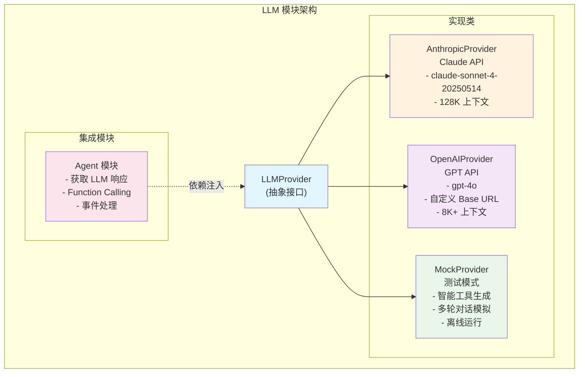
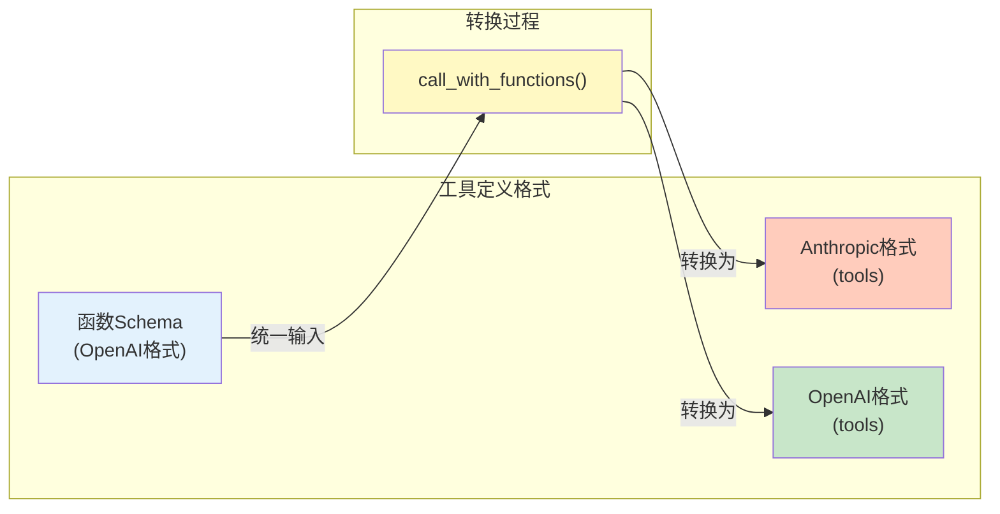
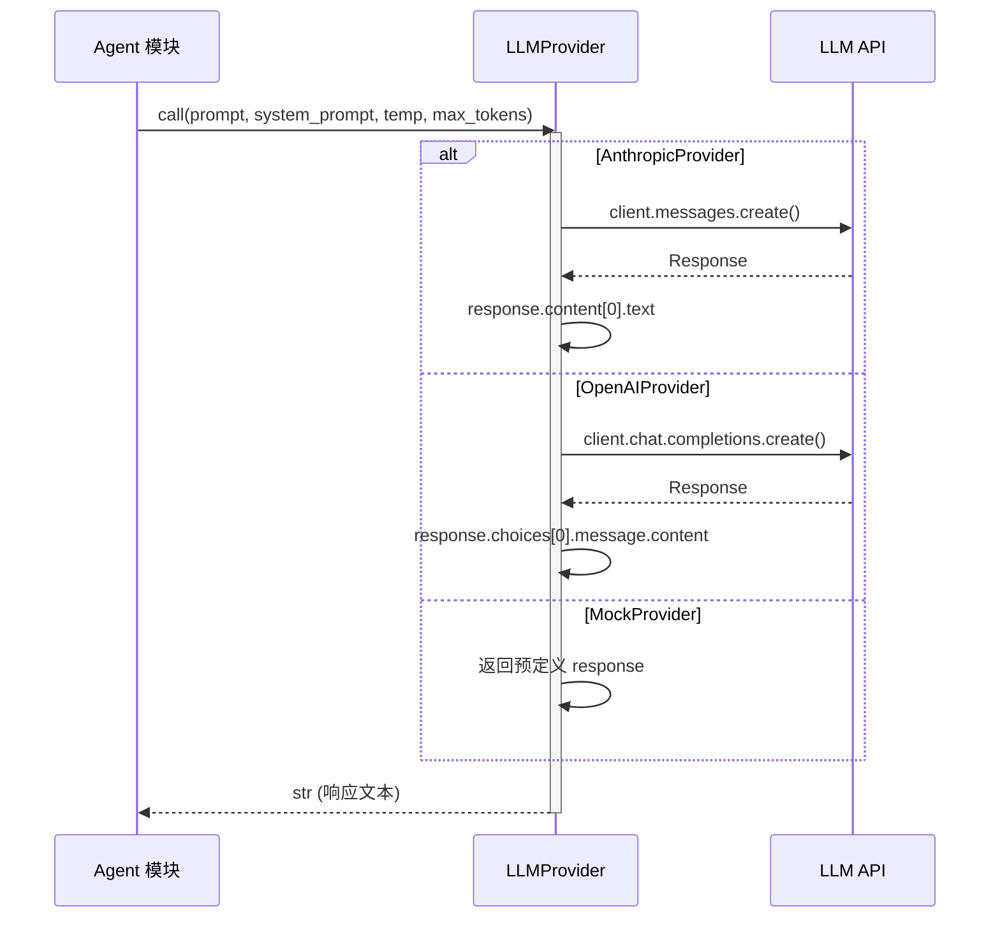
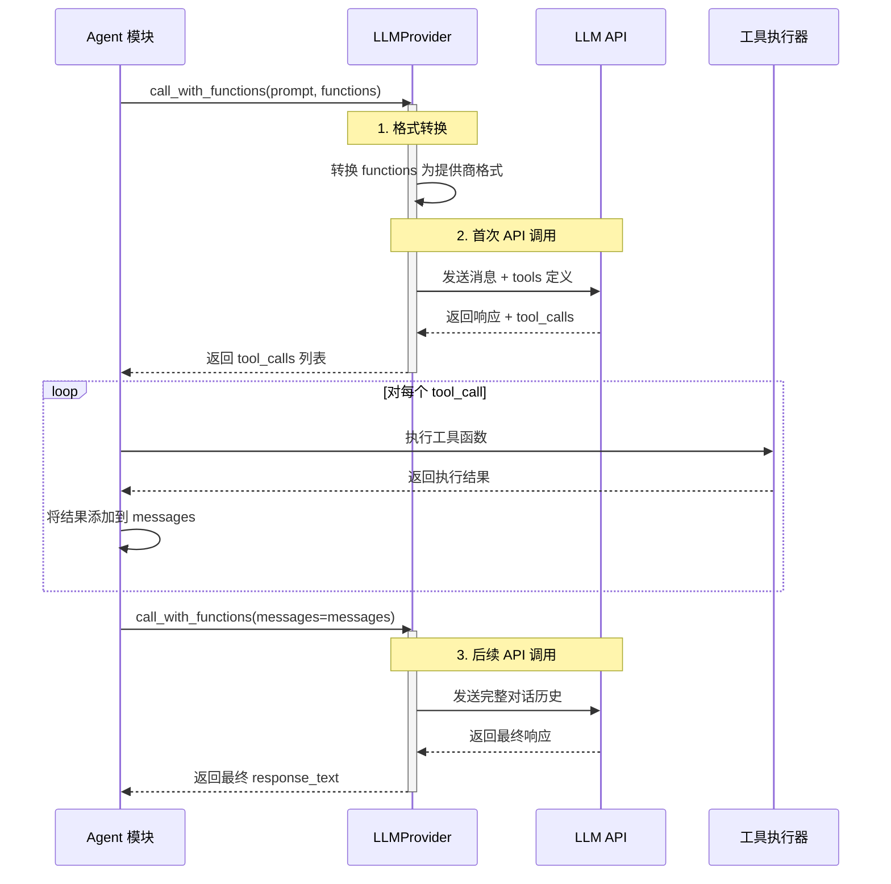
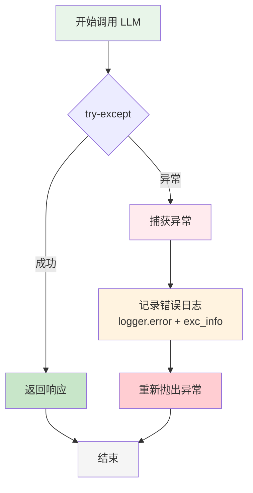
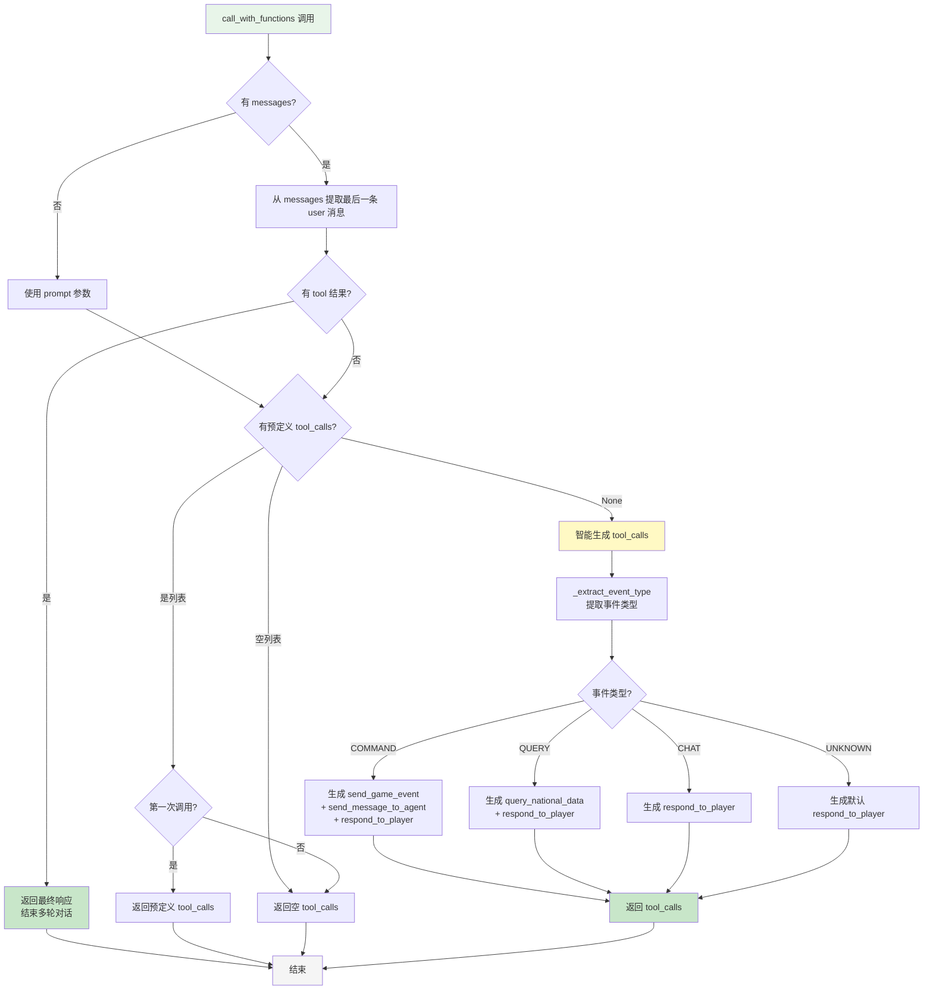
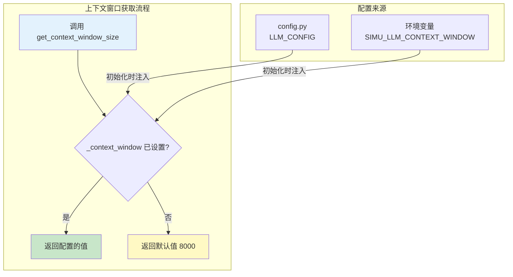

# LLM 模块文档

## 模块概述

`src/simu_emperor/llm` 模块是大语言模型（LLM）抽象层，提供统一的接口调用不同的 LLM 提供商。

### 核心特性
- **统一接口**: 所有 LLM 提供商都实现相同的 `LLMProvider` 接口
- **Function Calling 支持**: 完整的工具调用功能
- **可配置性**: 通过配置文件灵活切换提供商和模型
- **测试友好**: Mock 提供商支持智能工具调用生成

## 模块结构

```
src/simu_emperor/llm/
├── base.py          # 抽象基类 (LLMProvider)
├── anthropic.py     # Anthropic Claude 实现
├── openai.py        # OpenAI GPT 实现
└── mock.py          # Mock 测试实现
```

## 架构示意图

### 模块类图

```mermaid
classDiagram
    abstract class LLMProvider {
        <<abstract>>
        +call(prompt, system_prompt, temperature, max_tokens) str
        +call_with_functions(prompt, functions, system_prompt, temperature, max_tokens) dict
        +get_context_window_size() int
    }

    class AnthropicProvider {
        -client: AsyncAnthropic
        -model: str
        -_context_window: int
        +call(prompt, system_prompt, temperature, max_tokens) str
        +call_with_functions(prompt, functions, system_prompt, temperature, max_tokens) dict
        +get_context_window_size() int
    }

    class OpenAIProvider {
        -client: AsyncOpenAI
        -model: str
        -_context_window: int
        +call(prompt, system_prompt, temperature, max_tokens) str
        +call_with_functions(prompt, functions, system_prompt, temperature, max_tokens, messages) dict
        +get_context_window_size() int
    }

    class MockProvider {
        -response: str
        -tool_calls: list~dict~
        -call_count: int
        +call(prompt, system_prompt, temperature, max_tokens) str
        +call_with_functions(prompt, functions, system_prompt, temperature, max_tokens, messages) dict
        +set_response(response) None
        +set_tool_calls(tool_calls) None
        +reset() None
        -_generate_smart_tool_calls(prompt, system_prompt) list~dict~
        -_extract_event_type(prompt, system_prompt) str
    }

    class Agent {
        -llm: LLMProvider
        -agent_id: str
        +process_event(event) None
    }

    LLMProvider <|-- AnthropicProvider
    LLMProvider <|-- OpenAIProvider
    LLMProvider <|-- MockProvider

    Agent "1" --> "1" LLMProvider : 使用
```

### 提供商特性对比



## 接口设计

### LLMProvider 抽象接口

```python
class LLMProvider(ABC):
    async def call(
        prompt: str,
        system_prompt: str | None = None,
        temperature: float = 0.7,
        max_tokens: int = 2000,
    ) -> str

    async def call_with_functions(
        prompt: str,
        functions: list[dict[str, Any]],
        system_prompt: str | None = None,
        temperature: float = 0.7,
        max_tokens: int = 2000,
    ) -> dict[str, Any]

    def get_context_window_size() -> int
```

## 各提供商实现

### AnthropicProvider
- 使用 `anthropic` SDK 调用 Claude API
- 支持工具调用（tools）
- 模型：`claude-sonnet-4-20250514`

### OpenAIProvider
- 使用 `openai` SDK 调用 GPT API
- 支持自定义 API Base URL
- 模型：`gpt-4o`

### MockProvider
- 完全离线的测试实现
- 智能工具调用生成
- 支持多轮对话模拟

## Function Calling 支持

### 统一工具格式



### 工具函数格式
```python
function_schema = {
    "name": "function_name",
    "description": "函数描述",
    "parameters": {
        "type": "object",
        "properties": {...},
        "required": [...]
    }
}
```

### 提供商格式转换

| 提供商 | 输入格式 | 转换后格式 |
|--------|----------|------------|
| AnthropicProvider | OpenAI Schema | `{"name": str, "description": str, "input_schema": {...}}` |
| OpenAIProvider | OpenAI Schema | `{"type": "function", "function": {...}}` |
| MockProvider | OpenAI Schema | 智能生成 tool_calls |

## 运行流程

### LLM 调用流程



### Function Calling 完整流程



### 错误处理流程



### Mock Provider 智能工具生成流程



## 配置管理

### 环境变量
```bash
SIMU_LLM_PROVIDER=anthropic
SIMU_LLM_API_KEY=your-api-key
SIMU_LLM_MODEL=claude-sonnet-4-20250514
SIMU_LLM_CONTEXT_WINDOW=128000
```

### YAML 配置
```yaml
llm:
  provider: anthropic
  api_key: your-api-key
  model: claude-sonnet-4-20250514
  context_window: 128000
```

### 上下文窗口配置流程



## 开发约束

### 错误处理
- 显式错误信息
- API 调用错误处理
- 记录详细日志

### 异步模式
- 使用 async/await
- 并发调用使用 `asyncio.gather`

### 测试策略
- Mock Provider 用于单元测试
- 智能工具生成验证
