# Memory 模块文档

## 模块概述

`src/simu_emperor/memory` 模块实现了 V4 版本的事件驱动记忆系统，采用累积摘要和增量加载机制。

### 核心特性
- **累积摘要机制**: 压缩事件时生成和更新摘要
- **增量加载**: 基于 `window_offset` 的增量 tape 加载
- **锚点感知滑动窗口**: 保留关键事件的智能压缩
- **两级搜索**: 元数据过滤 → 事件段搜索
- **V4.2 Phase B 特性**:
  - TapeRepository 注入，支持 tape_events SQLite 双写
  - DB-first 读取策略，JSONL 降级兜底
  - VectorStore 封装向量搜索，带重试逻辑

## 架构设计

### 系统架构图

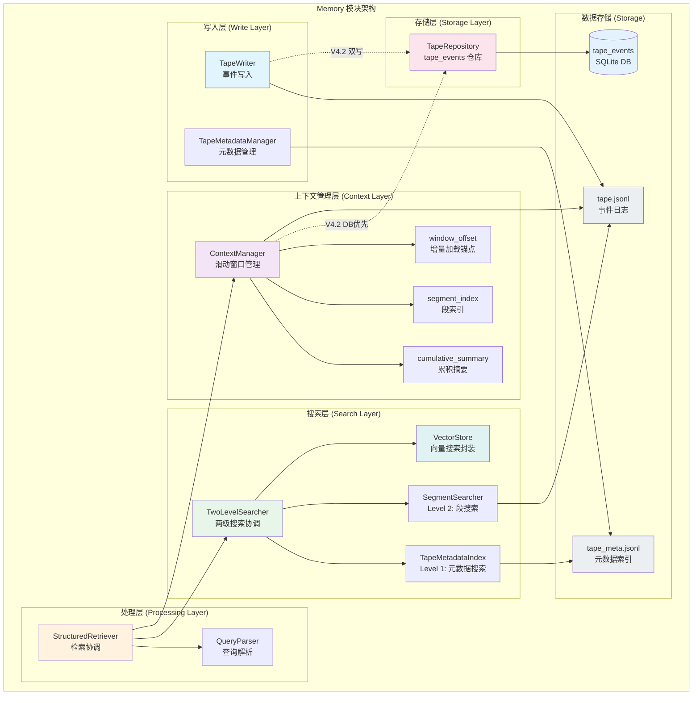

### 数据结构关系图

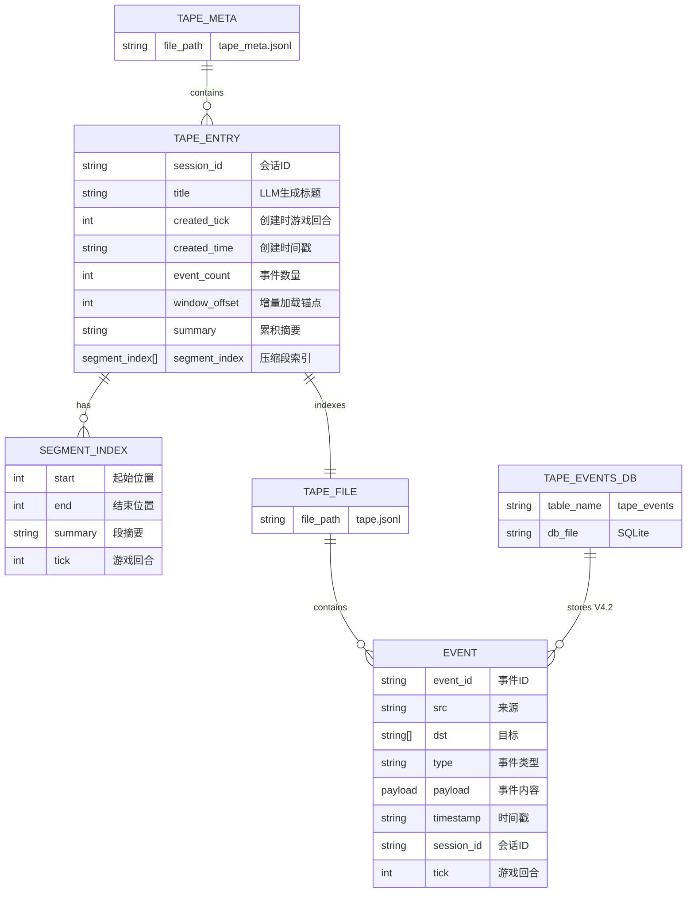

### 组件职责说明

| 层级 | 组件 | 职责 |
|------|------|------|
| **写入层** | TapeWriter | 事件持久化到 tape.jsonl + tape_events (V4.2 双写) |
| | TapeMetadataManager | 管理元数据索引 (tape_meta.jsonl) |
| **上下文层** | ContextManager | 滑动窗口上下文管理，V4.2 DB-first 读取 |
| | cumulative_summary | 累积摘要 (持续更新) |
| | segment_index | 压缩段索引 (已压缩事件的摘要) |
| | window_offset | 增量加载位置锚点 |
| **搜索层** | TwoLevelSearcher | 两级搜索协调器 |
| | TapeMetadataIndex | Level 1: 搜索元数据 |
| | SegmentSearcher | Level 2: 搜索事件段 |
| | VectorStore | V4.2: 向量搜索封装，带重试逻辑 |
| **处理层** | QueryParser | 自然语言查询解析 |
| | StructuredRetriever | 检索路由和结果格式化 |
| **存储层** | TapeRepository | V4.2: tape_events SQLite 仓库 |

## 关键类说明

### TapeWriter
**功能**：事件的写入器，负责将事件写入 `tape.jsonl` 文件

**构造签名 (V4.2)**：
```python
def __init__(
    self,
    tape_dir: str,
    session_id: str,
    ...,
    tape_repository: "TapeRepository | None" = None,  # V4.2 注入
) -> None:
```

**V4 新特性**：
- 首事件检测和自动标题生成
- 同步更新 `tape_meta.jsonl` 的事件计数
- 支持增量加载

**V4.2 Phase B 新特性**：
- **双写机制**：当 `tape_repository` 注入时，`write_event()` 同时写入 `tape_events` SQLite 表
- 关键代码 (L123-129)：
  ```python
  # 先写 JSONL (保持兼容)
  event_id = self._write_to_jsonl(event)
  # 双写到 tape_events DB
  if self._tape_repository is not None:
      self._tape_repository.insert(event)  # 异步双写
  ```

### ContextManager
**功能**：滑动窗口上下文管理器，控制 token 数量并管理历史摘要

**构造签名 (V4.2)**：
```python
def __init__(
    self,
    tape_dir: str,
    session_id: str,
    ...,
    tape_repository: "TapeRepository | None" = None,  # V4.2 注入
) -> None:
```

**滑动窗口策略**：
1. 锚点识别：user_query, response, key GAME_EVENTs
2. 保留最近 N 事件（默认 20）
3. 保留锚点附近 ±K 事件（默认 3）
4. 确保总 token ≤ 阈值（95% context window）

**V4.2 Phase B 读取策略 (DB-first)**：
- `_load_session_events()`：优先通过 `tape_repository.query_by_session()` 从 `tape_events` 读取，失败时降级到 JSONL
- `_read_events_from_offset(offset=N)`：优先 `tape_repository.query_by_session(offset=N)`，降级到 JSONL
- `_count_all_events()`：优先 `tape_repository.count_by_session()`，降级到 JSONL 行数统计
- 降级策略：当 `tape_repository` 为 `None` 或查询失败时，回退到传统 JSONL 读取

### VectorStore (V4.2)
**功能**：向量搜索的封装层，包装 `VectorSearcher` 并提供重试逻辑

**特性**：
- 封装底层 VectorSearcher 实现
- 内置重试机制，处理临时性向量数据库故障
- 统一的搜索接口，屏蔽底层实现细节
- 支持相似度搜索和元数据过滤

**典型用法**：
```python
vector_store = VectorStore(searcher=vector_searcher)
results = await vector_store.search(query_embedding, top_k=5)
```

### TapeRepository (V4.2)
**功能**：`tape_events` SQLite 表的仓库类，提供事件的 DB 持久化和查询

**核心方法**：
| 方法 | 说明 |
|------|------|
| `insert(event)` | 插入事件到 tape_events 表 |
| `query_by_session(session_id, offset=None)` | 按会话查询事件，支持分页 |
| `count_by_session(session_id)` | 统计会话事件数量 |
| `query_by_timerange(start, end)` | 按时间范围查询事件 |

**依赖注入**：
- TapeWriter 和 ContextManager 通过构造函数注入 `tape_repository`
- 注入为 `None` 时自动降级到纯 JSONL 模式（向后兼容）

## 详细运行流程

### 1. 事件写入流程 (TapeWriter.write_event)

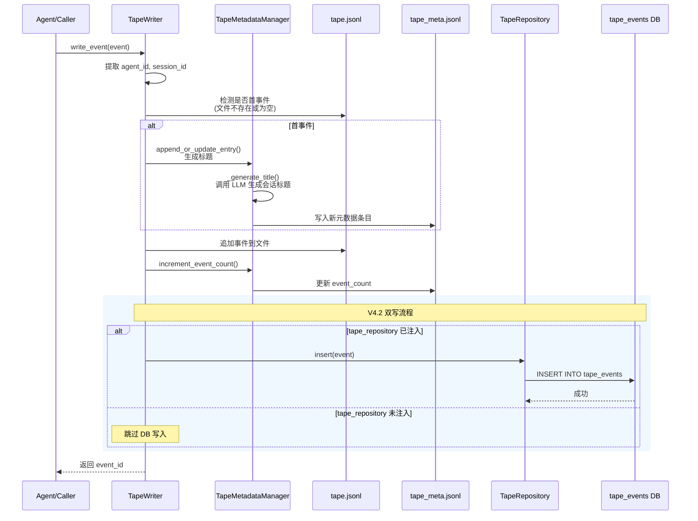

### 2. 累积摘要生成流程 (ContextManager.slide_window)

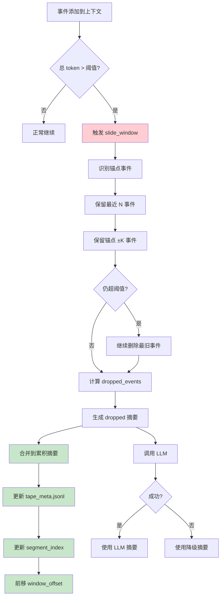

### 3. Context 滑动窗口流程

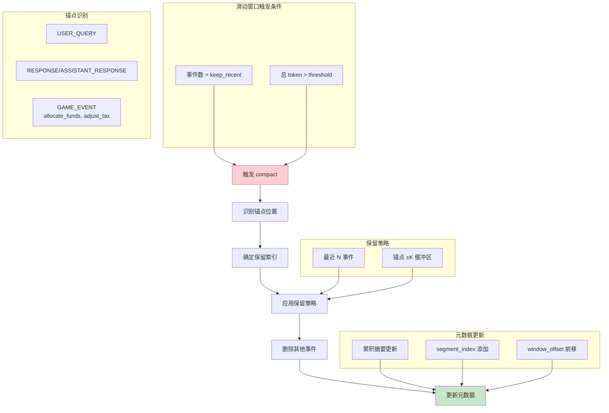

### 4. 跨会话检索流程

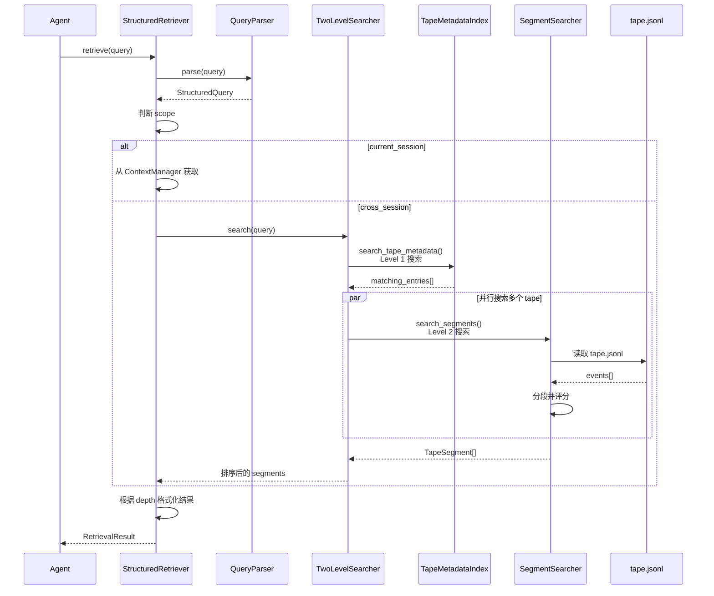

### 5. 增量加载流程 (从 tape 加载到 ContextManager)

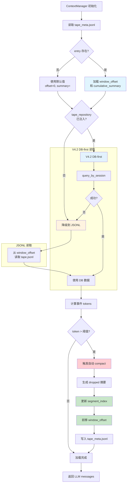

### 6. 两级搜索流程 (TwoLevelSearcher)

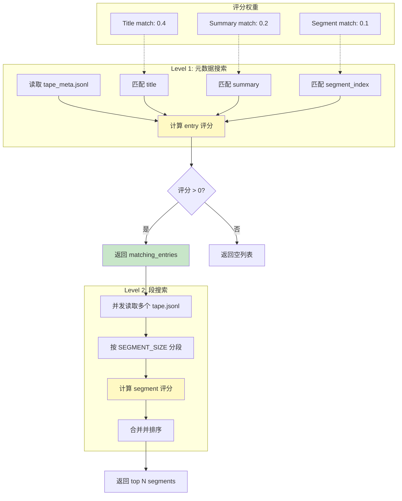

## Tape 文件格式

### tape.jsonl 结构

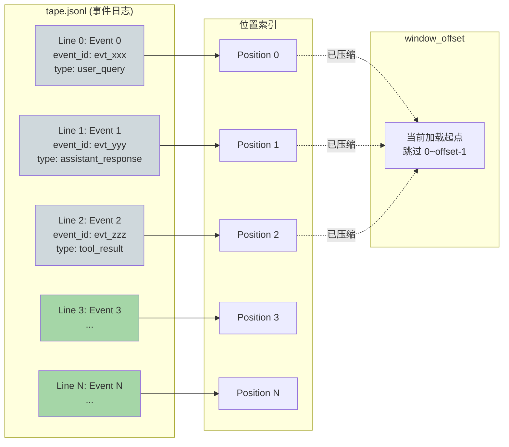

### tape.jsonl 事件格式

```json
{
  "event_id": "evt_20260314120000_a1b2c3d4",
  "src": "agent:governor_fujian",
  "dst": ["player"],
  "type": "command",
  "payload": {...},
  "timestamp": "2026-03-14T12:00:00.123456Z",
  "session_id": "session:web:governor_fujian:...",
  "tick": 42
}
```

### tape_meta.jsonl 结构

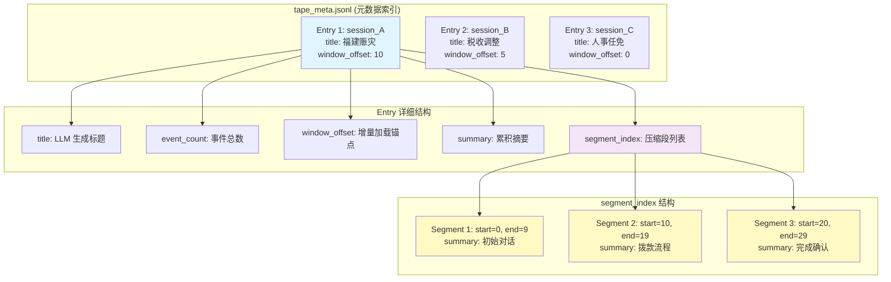

### tape_meta.jsonl 条目格式

```json
{
  "session_id": "session:web:...",
  "title": "福建赈灾拨款",
  "created_tick": 42,
  "created_time": "2026-03-14T12:00:00Z",
  "last_updated_tick": 45,
  "last_updated_time": "2026-03-14T15:30:00Z",
  "event_count": 15,
  "window_offset": 10,
  "summary": "处理福建赈灾事宜，完成三次拨款申请",
  "segment_index": [
    {"start": 0, "end": 9, "summary": "福建赈灾申请", "tick": 42}
  ]
}
```

### 索引结构映射关系

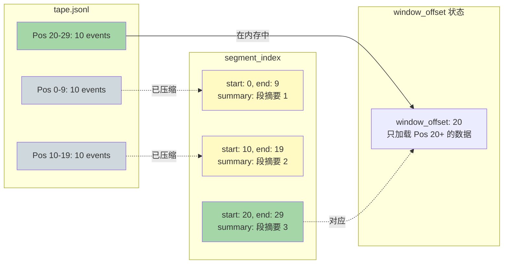

### manifest.json 结构 (V3 遗留，V4 已弃用)

> **注意**: V4 中 `ManifestIndex` 已弃用，请使用 `TapeMetadataManager` 和 `SessionManager`。

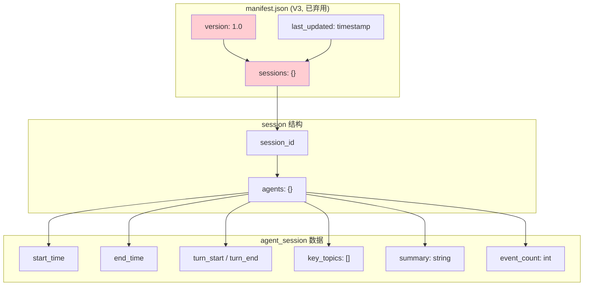

## 开发约束

### 1. 并发安全
- 原子写入：所有文件操作使用 temp file + rename 模式
- 幂等操作：更新操作设计为幂等

### 2. 性能优化
- 增量加载：基于 `window_offset` 的增量 tape 读取
- 并发搜索：使用 `asyncio.gather` 并行搜索多个 tapes
- **V4.2**: DB-first 读取策略，SQLite 索引优化查询性能

### 3. 错误处理
- 静默失败：索引搜索失败不应阻塞主要流程
- 降级策略：LLM 调用失败时使用简单摘要
- **V4.2**: DB 查询失败时自动降级到 JSONL 读取

### 4. V4.2 兼容性约束
- **向后兼容**：`tape_repository` 为 `None` 时完全兼容 V4.1 行为
- **双写不阻塞**：DB 写入失败不影响 JSONL 写入成功
- **优雅降级**：DB 不可用时自动回退到 JSONL，不抛出异常
