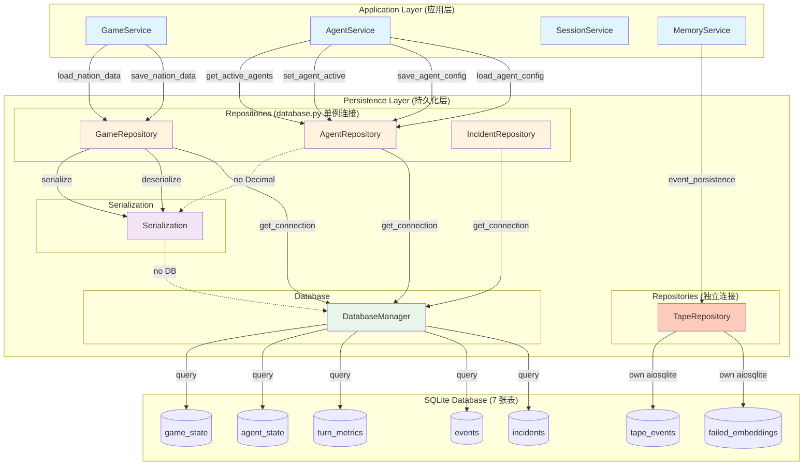
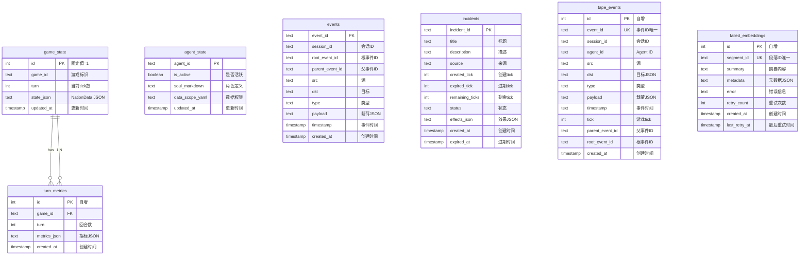
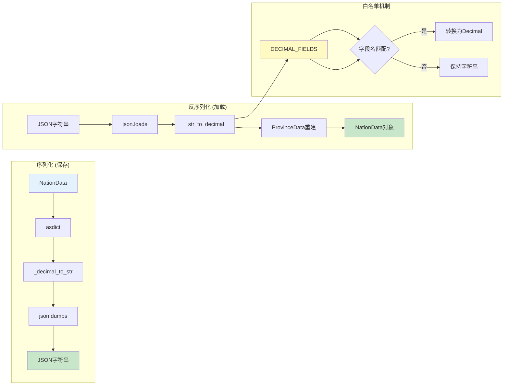
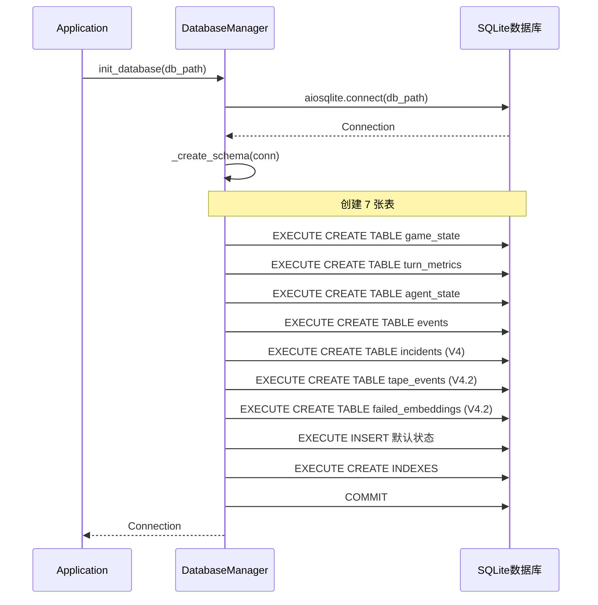
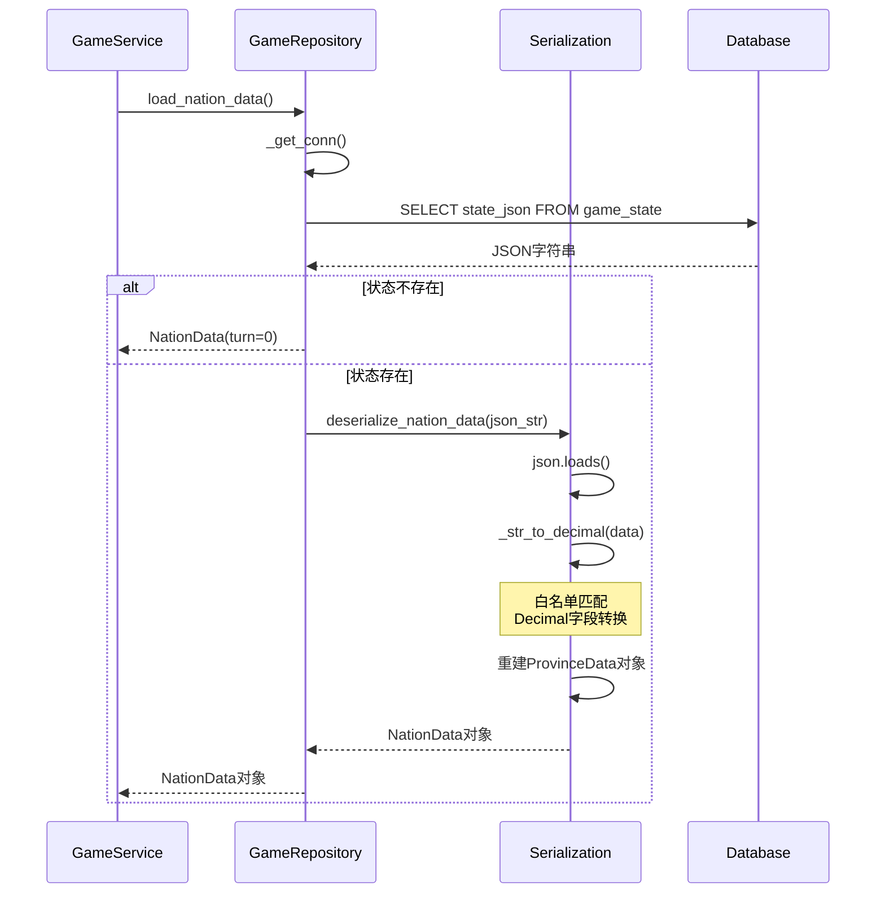
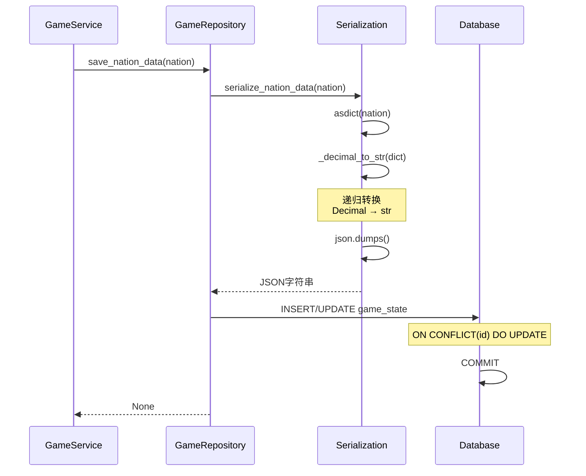
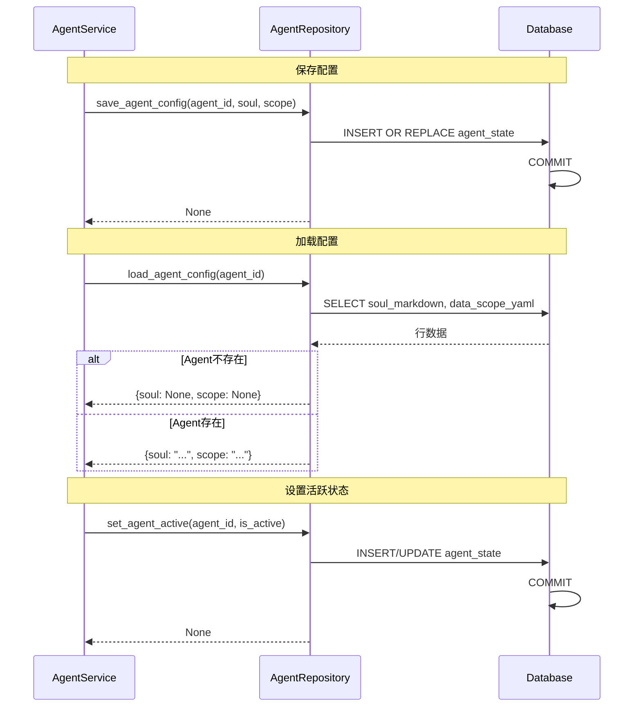
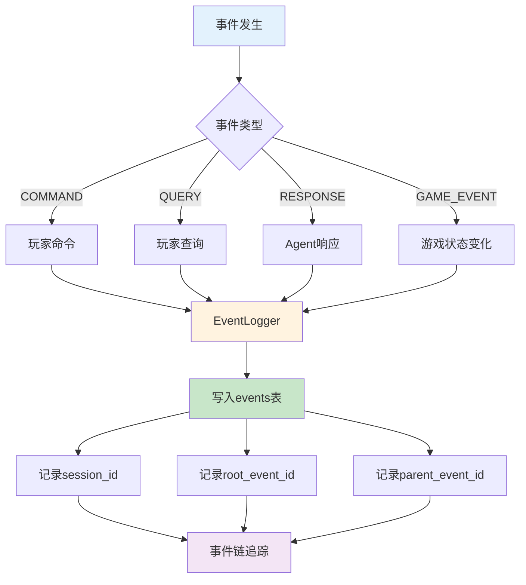

# Persistence 模块文档

## 模块概述

**Persistence 模块** 是数据持久化层，负责管理游戏状态和 Agent 相关数据的持久化存储。

### 核心职责
- **数据库连接管理**: 创建、管理和关闭 SQLite 数据库连接
- **数据持久化**: 保存和加载游戏状态（NationData）及 Agent 配置
- **序列化处理**: 处理复杂对象（特别是 Decimal 类型）与 JSON 的转换
- **Repository 模式封装**: 提供高级 API 抽象底层 SQL 操作

## 架构设计

### 模块架构图



### 数据库表结构关系 (V4.2 - 7 张表)



### Decimal 序列化处理流程



## 关键类说明

### GameRepository
游戏状态持久化管理

**核心方法**:
```python
async def load_nation_data() -> NationData
async def save_nation_data(nation: NationData) -> None
async def get_current_tick() -> int
async def initialize_default_state() -> None
```

### AgentRepository
Agent 状态和配置管理

**核心方法**:
```python
async def get_active_agents() -> list[str]
async def set_agent_active(agent_id: str, is_active: bool = True) -> None
async def save_agent_config(agent_id: str, soul_markdown: str = None, data_scope_yaml: str = None)
async def load_agent_config(agent_id: str) -> dict
```

### IncidentRepository (Phase A - V4)
Incident 持久化管理

**核心方法**:
```python
async def save_incident(incident, tick: int) -> None
async def expire_incident(incident_id: str, tick: int) -> None
async def load_active_incidents() -> list[Incident]
async def get_incident_history(limit: int = 20, source: str = None) -> list[dict]
```

### TapeRepository (Phase B - V4.2)
磁带式事件存储仓库

> ⚠️ **重要**: TapeRepository 拥有**独立的 aiosqlite 连接**，与 database.py 模块级单例连接分离。需手动调用 `initialize()` 和 `close()` 管理生命周期。

**核心方法**:
```python
# 生命周期管理
def __init__(db_path: str = "game.db")
async def initialize() -> None      # 创建独立数据库连接
async def close() -> None           # 关闭连接

# tape_events 表操作
async def insert_event(event: Event, agent_id: str, tick: int = None) -> None
async def query_events(
    session_id: str = None,
    agent_id: str = None,
    event_type: str = None,
    tick: int = None,
    limit: int = 100,
    offset: int = 0
) -> list[dict]
async def count_events(session_id: str) -> int
async def query_by_session(
    session_id: str,
    agent_id: str = None,
    offset: int = 0,
    limit: int = 10000
) -> list[dict]  # ORDER BY timestamp ASC, id ASC
async def count_by_session(session_id: str, agent_id: str = None) -> int

# failed_embeddings 表操作
async def record_failed_embedding(
    segment_id: str,
    summary: str,
    metadata: dict,
    error: str
) -> None
async def get_failed_embeddings(limit: int = 100) -> list[dict]
async def mark_embedding_retried(segment_id: str) -> None
async def remove_failed_embedding(segment_id: str) -> None
```

## 数据库表结构

### game_state
```sql
CREATE TABLE game_state (
    id INTEGER PRIMARY KEY CHECK (id = 1),
    state_json TEXT NOT NULL,
    updated_at TIMESTAMP DEFAULT CURRENT_TIMESTAMP
);
```

### agent_state
```sql
CREATE TABLE agent_state (
    agent_id TEXT PRIMARY KEY,
    is_active INTEGER NOT NULL DEFAULT 0,
    soul_markdown TEXT,
    data_scope_yaml TEXT,
    updated_at TIMESTAMP DEFAULT CURRENT_TIMESTAMP
);
```

### events
```sql
CREATE TABLE events (
    event_id TEXT PRIMARY KEY,
    session_id TEXT NOT NULL,
    root_event_id TEXT NOT NULL,
    parent_event_id TEXT,
    src TEXT NOT NULL,
    dst TEXT NOT NULL,
    type TEXT NOT NULL,
    payload TEXT NOT NULL,
    timestamp TEXT NOT NULL
);
```

### incidents (Phase A - V4)
```sql
CREATE TABLE IF NOT EXISTS incidents (
    incident_id TEXT PRIMARY KEY,
    title TEXT NOT NULL,
    description TEXT NOT NULL,
    source TEXT NOT NULL,
    created_tick INTEGER NOT NULL,
    expired_tick INTEGER,
    remaining_ticks INTEGER NOT NULL,
    status TEXT NOT NULL DEFAULT 'active',
    effects_json TEXT NOT NULL,
    created_at TEXT NOT NULL,
    expired_at TEXT
);
```

### tape_events (Phase B - V4.2)
```sql
CREATE TABLE IF NOT EXISTS tape_events (
    id INTEGER PRIMARY KEY AUTOINCREMENT,
    event_id TEXT UNIQUE NOT NULL,
    session_id TEXT NOT NULL,
    agent_id TEXT NOT NULL,
    src TEXT NOT NULL,
    dst TEXT NOT NULL,
    type TEXT NOT NULL,
    payload TEXT NOT NULL,
    timestamp TEXT NOT NULL,
    tick INTEGER,
    parent_event_id TEXT,
    root_event_id TEXT,
    created_at TEXT DEFAULT CURRENT_TIMESTAMP
);
```

### failed_embeddings (Phase B - V4.2)
```sql
CREATE TABLE IF NOT EXISTS failed_embeddings (
    id INTEGER PRIMARY KEY AUTOINCREMENT,
    segment_id TEXT UNIQUE NOT NULL,
    summary TEXT NOT NULL,
    metadata TEXT NOT NULL,
    error TEXT NOT NULL,
    retry_count INTEGER DEFAULT 0,
    created_at TEXT NOT NULL,
    last_retry_at TEXT
);
```

## 开发约束

### 连接管理

**模块级单例连接** (database.py 管理):
```python
# 应用启动时初始化
await init_database()

# 获取连接（GameRepository, AgentRepository, IncidentRepository 使用）
conn = await get_connection()

# 应用关闭时清理
await close_database()
```

**TapeRepository 独立连接** (V4.2 新增):
```python
# TapeRepository 有自己的 aiosqlite 连接，不使用模块单例
tape_repo = TapeRepository(db_path="game.db")
await tape_repo.initialize()  # 创建独立连接

# 使用...
await tape_repo.insert_event(event, agent_id, tick)

# 必须手动关闭
await tape_repo.close()
```

> ⚠️ **注意**: TapeRepository 的独立连接设计是为了隔离事件存储的 IO 负载，避免阻塞主数据库连接。

### V4 推荐 API
```python
# 使用 NationData 对象
nation = await repo.load_nation_data()
await repo.save_nation_data(nation)
```

### Decimal 处理
- 序列化自动处理 Decimal → str
- 反序列化自动处理 str → Decimal（白名单）

## 详细运行流程

### 数据库初始化流程



### NationData 加载流程



### NationData 保存流程



### Agent 配置读写流程



### 事件记录流程



### TapeRepository 生命周期流程 (V4.2)

```mermaid
sequenceDiagram
    participant App as MemoryService
    participant Repo as TapeRepository
    participant DB as SQLite

    Note over App,DB: 初始化阶段
    App->>Repo: new TapeRepository(db_path)
    App->>Repo: initialize()
    Repo->>DB: aiosqlite.connect(db_path)
    DB-->>Repo: Connection (独立连接)
    Repo-->>App: Ready

    Note over App,DB: 事件记录
    App->>Repo: insert_event(event, agent_id, tick)
    Repo->>DB: INSERT INTO tape_events
    DB-->>Repo: OK

    Note over App,DB: 事件查询
    App->>Repo: query_by_session(session_id)
    Repo->>DB: SELECT * FROM tape_events WHERE...
    DB-->>Repo: Rows
    Repo-->>App: Event List

    Note over App,DB: Embedding 失败记录
    App->>Repo: record_failed_embedding(...)
    Repo->>DB: INSERT INTO failed_embeddings
    DB-->>Repo: OK

    Note over App,DB: 关闭阶段
    App->>Repo: close()
    Repo->>DB: conn.close()
    DB-->>Repo: Closed

    style App fill:#e1f5fe
    style Repo fill:#ffccbc
    style DB fill:#e8f5e9
```
