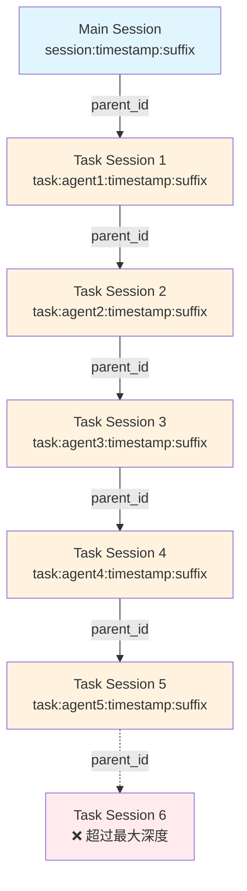
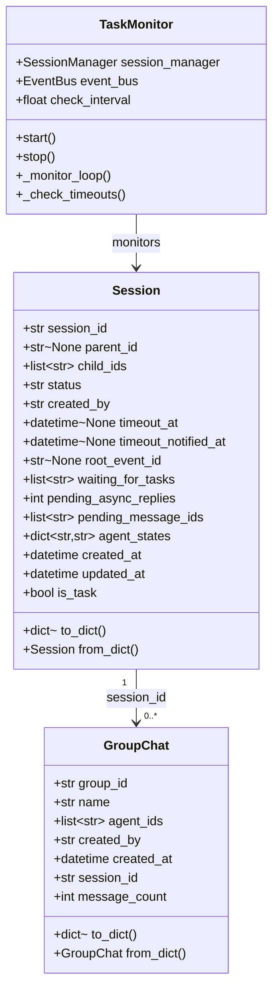
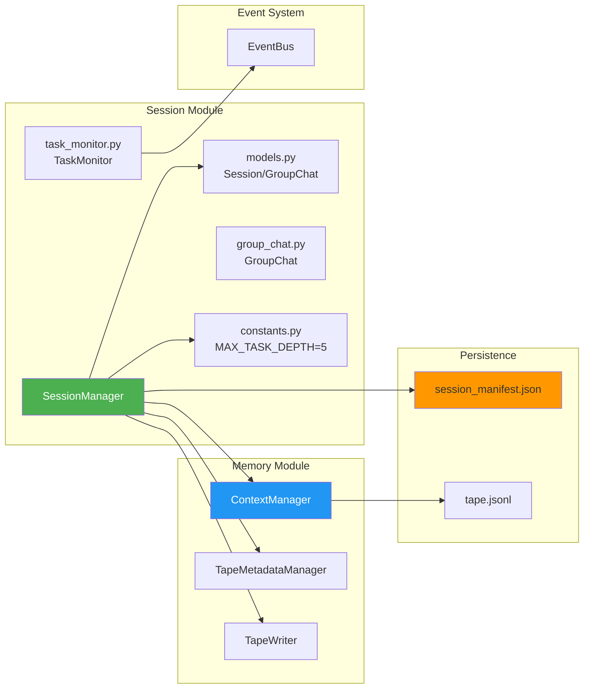
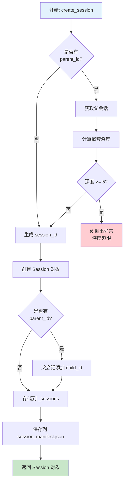
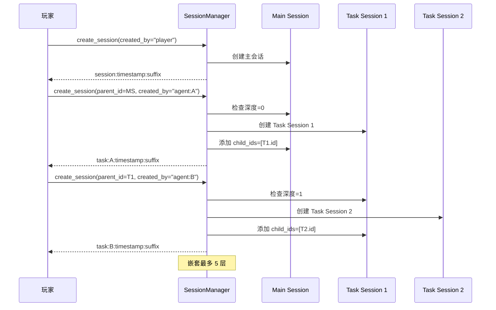
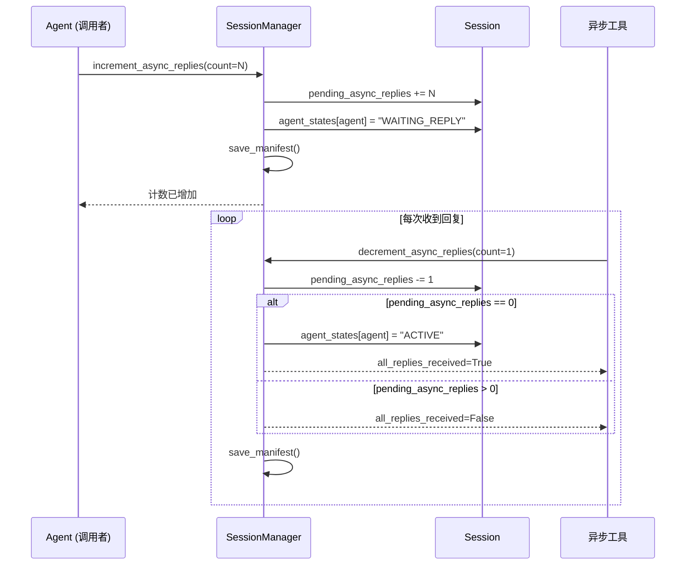
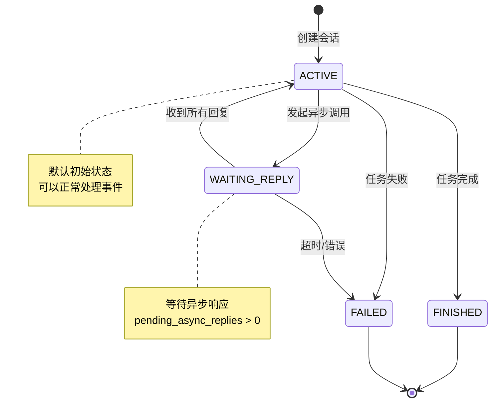
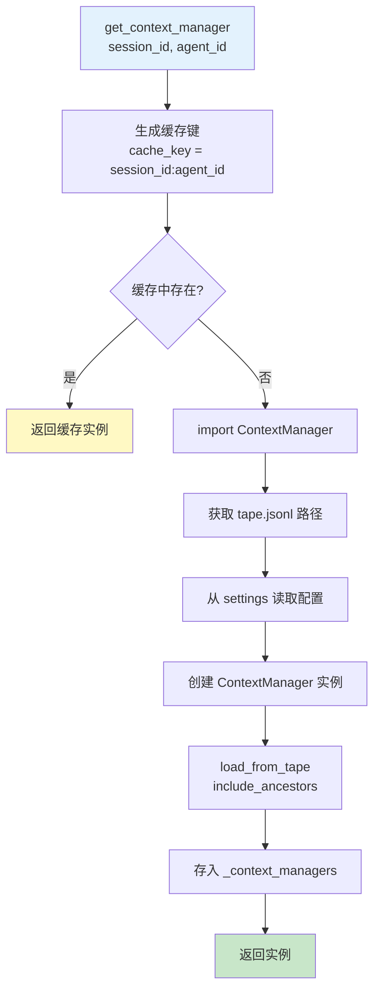

# Session 模块文档

## 模块概述

`src/simu_emperor/session` 模块实现了 V4 任务会话架构，提供了完整的会话生命周期管理。

### 核心特性
- **会话嵌套机制**: 支持 Task Session 嵌套，最大深度 5 层
- **Per-Agent 状态管理**: 每个会话中每个 Agent 的独立状态跟踪
- **异步响应管理**: 支持异步工具调用的等待和恢复机制
- **ContextManager 集成**: 无缝集成上下文管理系统
- **持久化支持**: 会话状态持久化到 `session_manifest.json`

## 架构设计

### 模块结构
```
src/simu_emperor/session/
├── __init__.py
├── constants.py     # 常量定义
├── models.py        # 数据模型
├── manager.py      # 会话管理器
├── group_chat.py   # 群聊模型
└── task_monitor.py # 任务监控
```

### 架构示意图

#### Session 嵌套结构



#### Session 数据模型结构



#### SessionManager 与各组件关系



## 关键类说明

### SessionManager
会话管理的核心类

**核心功能**：
- 会话生命周期管理
- 会话嵌套深度控制（最大 5 层）
- Per-Agent 状态管理
- 异步响应计数管理
- ContextManager 实例缓存

### Session 数据模型

**核心字段**：
- `session_id`: 会话唯一标识
- `parent_id`: 父会话 ID
- `child_ids`: 子会话列表
- `status`: 会话状态
- `agent_states`: Per-Agent 状态字典
- `pending_async_replies`: 异步响应计数

## 会话状态机

| 状态 | 描述 |
|------|------|
| `ACTIVE` | 活跃状态 |
| `WAITING_REPLY` | 等待回复 |
| `FINISHED` | 已完成 |
| `FAILED` | 已失败 |

## 会话嵌套机制

### 命名规范
- Main Session: `session:{timestamp}:{suffix}`
- Task Session: `task:{agent_id}:{timestamp}:{suffix}`

### 嵌套示例
```
Main Session
└── Task Session 1
    └── Task Session 2
        └── Task Session 3
            └── Task Session 4 (❌ 超过最大深度)
```

## session_manifest.json 结构

```json
{
  "version": "2.0",
  "last_updated": "2026-03-15T12:00:00.000000Z",
  "sessions": {
    "session:20260315120000:a1b2c3d4": {
      "parent_id": null,
      "child_ids": ["task:agent1:20260315120001:b2c3d4e5"],
      "status": "ACTIVE",
      "created_by": "player",
      "timeout_at": null,
      "timeout_notified_at": null,
      "root_event_id": null,
      "waiting_for_tasks": [],
      "pending_async_replies": 0,
      "pending_message_ids": [],
      "agent_states": {
        "agent:revenue_minister": "ACTIVE",
        "agent:governor_zhili": "WAITING_REPLY"
      },
      "created_at": "2026-03-15T12:00:00.000000Z",
      "updated_at": "2026-03-15T12:00:00.000000Z"
    }
  }
}
```

## 详细运行流程

### 会话创建流程



### 会话嵌套流程



### 异步回复计数流程



### 会话状态转换流程



### ContextManager 实例缓存流程



## 异步回复管理

```python
# 增加异步回复计数
await session_manager.increment_async_replies(session_id, agent_id, count=1)

# 减少异步回复计数
all_replies_received, remaining = await session_manager.decrement_async_replies(
    session_id, agent_id, count=1
)
```

## 开发约束

### 会话创建约束
- 最大嵌套深度：5 层
- Task Session 最多 2 个成员

### 状态管理
- 惰性初始化：首次访问时自动初始化为 ACTIVE
- 状态持久化：任何状态变更都会自动保存

### ContextManager 使用
- 懒加载：在首次请求时创建并缓存
- 按 `{session_id}:{agent_id}` 缓存实例
